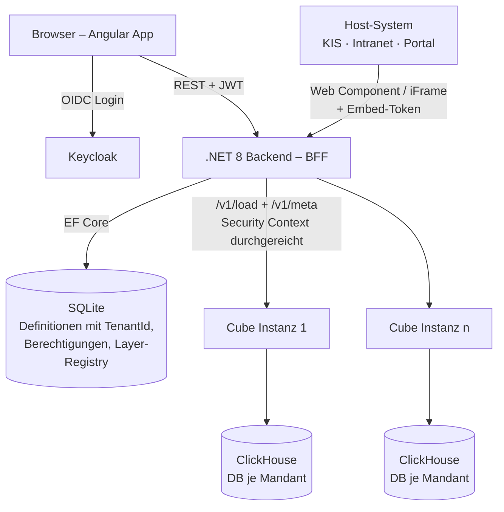
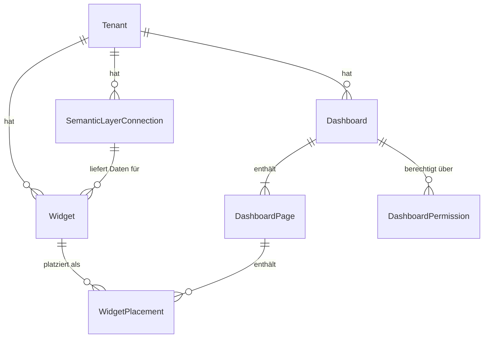

# AnalyseGUI – Implementierungsplan (MOC)

> [!abstract] Zweck
> Einstiegspunkt für die Implementierungsplanung der **Analyse-Applikation** (Frontend + zugehöriges Applikations-Backend) gemäß [[Architekturansatz A – ClickHouse + Cube Core + Custom Frontend|Architekturansatz A]]. Ziel ist ein **Feature-Split**, der von mehreren Agenten parallel/inkrementell umgesetzt werden kann: vom Projekt-Setup bis zu einzelnen User-Workflows, jeweils mit technischen Details in eigenen Feature-Dokumenten.

> [!success] Getroffene Entscheidungen (07/2026)
> 1. **BFF-Pattern** – Frontend spricht ausschließlich mit dem .NET-Backend; alle Cube-Queries laufen durchs Backend (F-A3).
> 2. **Semantic Layer** – n Cube-**Instanzen** registrierbar **und** je Instanz n Cubes nutzbar (F-A4).
> 3. **Widget-API = Embedding** – liefert das fertige Widget inkl. Daten als **Web Component / iFrame**; reine Datenabfragen laufen direkt gegen Cube, nicht über diese App (F-A5).
> 4. **Mandantenübergreifend** – Tenant-Bezug (`TenantId`) in allen SQLite-Definitionen; Tenant aus Keycloak-Claim, Kontextschalter in der Shell (F-A8).
> 5. **Berechtigungen** an User, Rollen **und** Gruppen mit **Union-Semantik** (F-A6); „Designer" als privilegierte Keycloak-Rolle.
> 6. **Widget-Änderungen wirken sofort** in allen referenzierenden Dashboards; keine Versionierung zum Start, Duplizieren als Varianten-Weg (F-A7).
> 7. **Ein Repository**, Backend und Frontend in zwei Master-Ordnern `/backend` und `/frontend` (F-A1).
> 8. **Aktuelle Angular-Version**; VIA-Design-System kommt später – Start mit eigener Design-Token-Schicht, damit der VIA-Umstieg ein Token-Austausch bleibt (F-A2).
> 9. **Cube existiert bereits mit Daten** – Dev-Umgebung verbindet sich per Konfiguration gegen die bestehende Instanz, kein lokaler ClickHouse/Cube-Stack (F-A12).
> 10. **Deutsch zum Start, multilingual vorbereitet** – alle Texte über Translation-Keys, weitere Sprachen sind reine Datei-Ergänzung (F-A9).
> 11. **Release-Schnitt bestätigt (F-A11):** Kernrelease = Phase 0–2 + F15/F16/F17 inkl. Tabellen-Widget; Iteration 2 = F18, F19, F09/F20 (Embedding), Drill-down, Cross-Filtering, Pivot.
> 12. **CGM-Farbwelt im Grunddesign:** Die Design-Token-Schicht startet mit der CGM-Markenpalette (CGM-Blau `#003366` als Kernfarbe) statt einer generischen Palette – verbindliche Werte, Chart-Palette und Kontrast-Leitplanken in [[Design-Tokens & CGM-Farbwelt]]; Verifikation gegen das interne CGM Brand Portal vor F04-Umsetzung.
> 13. **Frontend-Technologie: vorerst React (07/2026, ersetzt die Angular-Festlegung aus F-A2).** Basis ist das Lovable-Frontend (`/frontend`: React 19, TanStack Start/Router, shadcn/ui, Zustand, ECharts, react-grid-layout). Angular-/VIA-Bezüge in den Feature-Dokumenten F04–F14 sind **technologieneutral zu lesen** (z. B. gridster2 → react-grid-layout, Signals-Stores → Zustand, Angular Elements → Web-Component-Äquivalent); die Architektur-Leitplanken (BFF, ein Render-Pfad, Token-Schicht) gelten unverändert.

> [!warning] Arbeitsstand
> Version 0.6. Feature-Detaildokumente (Vorlage: [[_Feature-Template]]) sind ausgearbeitet für **Phase 0–2** (F00–F08, F10–F14) sowie **Phase 4** (F21–F28, aus dem Funktionsabgleich mit dem Lovable-Frontend, 2026-07-29). Offen: F-A10 sowie zwei Restpunkte (CI-Plattform, Herkunft der Listbox-Komponenten), siehe [[Offene Fragen – AnalyseGUI]].

---

## 1 · Scope

**In Scope (diese Applikation):**

- Angular-Frontend (Analyse-Oberfläche): Widget-Designer, Dashboard-Designer, Dashboard-Viewer, Katalog/Navigation
- .NET-8-Applikations-Backend: Definitions-Persistenz (SQLite, mandantenübergreifend mit Tenant-Bezug), Widget-/Dashboard-API, Cube-Anbindung, Auth-Integration (Keycloak)
- **Widget-Embedding-API**: Auslieferung fertig gerenderter Widgets (Web Component / iFrame) an Drittsysteme – identischer Render- und Rechte-Pfad wie im Dashboard

**Out of Scope (separate Vorhaben laut Architekturansatz A):**

- Rechte- & Konfigurations-Administration für den Semantic Layer (Consultant-GUI, Abschnitt 2.5 in Ansatz A)
- **Reine Daten-APIs für Drittsysteme** – die liefert Cube selbst (REST/GraphQL/SQL)
- ETL / DWH→ClickHouse-Sync, Cube-Fachmodell-Pflege
- Event-/Alerting-Engine, KI/NLQ – Schnittstellen werden aber nicht verbaut
- ~~Report-Engine (PDF/Berichtsmappen)~~ → **teilweise in Scope geholt (07/2026):** druckorientierte Berichte inkl. PDF-Erzeugung und zeitgesteuerter Verteilung sind jetzt F21/F22 (Phase 4); nur ereignis-/schwellwertbasiertes Alerting bleibt außen vor

---

## 2 · Technologie-Stack (gesetzt)

| Schicht | Technologie | Anmerkung |
| --- | --- | --- |
| Backend | .NET 8 (ASP.NET Core Web API) | Systemkonfiguration über `appsettings.json` (+ Environment-Overrides, Options-Pattern) |
| Persistenz (Definitionen) | SQLite via EF Core 8 | Widgets, Dashboards, Berechtigungen, Semantic-Layer-Registry – alle Entitäten mit `TenantId` |
| Semantic Layer | Cube Core (REST + Meta-API), n Instanzen | Daten kommen **ausschließlich** über Cube; nie direkt aus ClickHouse |
| Auth | Keycloak (OIDC) | Ein User-Ident über Frontend, Backend und Cube hinweg; Tenant- und Rollen-Claims im JWT |
| Frontend | **React 19 + TanStack Start/Router, shadcn/ui, Zustand** (Entscheidung 13; ersetzt Angular aus F-A2) | Basis: Lovable-Frontend in `/frontend`; Design-Token-Schicht bleibt Pflicht (VIA-Vorbereitung) |
| Charts | Apache ECharts (React-Anbindung) | Theme `hbi` auf CGM-Farb-Tokens ([[Design-Tokens & CGM-Farbwelt]]); VIA-Umstieg später per Token-Austausch (F-A2) |
| Grid-Layout | react-grid-layout (im Lovable-Frontend im Einsatz) | Freie Anordnung, Drag & Resize, responsive |
| Filter-Widgets | Filter-Widget-Typ mit Modi Dropdown · Listbox (vertikal) · Button-Leiste (horizontal) | shadcn/ui-basiert; Herkunftsfrage der Alt-Listboxen (F-A2-Restpunkt) damit weitgehend obsolet |
| Embedding | Web Component + iFrame-Route | gemäß F-A5 / Ansatz A F9; Paketierung React-basiert (F20 technologieneutral lesen) |

---

## 3 · Zielarchitektur der Applikation

**Leitplanken:**

1. **Frontend enthält keine Fachlogik** – es rendert Widget-Definitionen und Cube-Resultsets.
2. **BFF gesetzt (F-A3):** Kein direkter Cube-Zugriff aus dem Browser. Das Backend validiert jede Query gegen die gespeicherte Widget-Definition (verhindert clientseitige Query-Manipulation), reicht den Security Context durch und auditiert.
3. **Widgets reichen die Nutzeridentität in den Semantic Layer durch** – keine eigene Datenrechte-Logik in der App; Cube ist Single Point of Truth für Zeilen-/Spaltenrechte. Die App prüft nur **App-Ebene** (Dashboard-Zugriff, Gestaltungsrechte).
4. **Zwei-Ebenen-Berechtigung**: Dashboard-Zugriff = App-Ebene (SQLite, Union über User/Rolle/Gruppe), Datenausschnitt = Cube. Ein teilbefülltes Dashboard ist ein legitimer Zustand.
5. **Mandantenübergreifender Betrieb (F-A8):** Jede Definitionsentität trägt `TenantId`; der aktive Tenant kommt aus dem Token (Kontextschalter bei Mehrfach-Zugehörigkeit). Jede Backend-Query filtert serverseitig auf den aktiven Tenant (globaler EF-Query-Filter) – kein Tenant-Parameter vom Client wird ungeprüft übernommen.
6. **Definitionen als versionierte JSON-Dokumente** in SQLite (`schemaVersion`-Feld) für Definitions-Migrationen bei App-Updates.
7. **Ein Render-Pfad für alles:** Dashboard-Viewer, Web-Component-Embedding und iFrame nutzen denselben Widget-Renderer und dieselben Backend-Endpunkte.

---

## 4 · Datenmodell SQLite (Entwurf)

| Entität | Kernfelder (Auszug) |
| --- | --- |
| `Tenant` | `Id (GUID)`, `Name`, `KeycloakTenantClaim`, `Enabled` – Spiegel der Mandanten; Zuordnung über Token-Claim |
| `SemanticLayerConnection` | `Id (GUID)`, `TenantId`, `Name`, `BaseUrl`, `AuthMode`, `Enabled` – Registry der n Cube-Instanzen; innerhalb einer Verbindung liefert die Meta-API n Cubes (F-A4) |
| `Widget` | `Id (GUID)`, `TenantId`, `Name`, `Type` (chart · kpi · table · filter · text …), `DefinitionJson` (Query: Cube/Measures/Dimensionen/Filter/Sortierung · Visualisierung: Charttyp, Farben, Formate, Achsen · KPI: Wert, Vergleich, Trend), `SchemaVersion`, `SemanticLayerId`, `CreatedBy/At`, `ModifiedBy/At` |
| `Dashboard` | `Id (GUID)`, `TenantId`, `Name`, `Description`, `Tags`, `ThemeJson`, `GlobalFilterConfigJson`, `SchemaVersion`, Audit-Felder |
| `DashboardPage` | `Id (GUID)`, `DashboardId`, `Title`, `SortOrder` |
| `WidgetPlacement` | `Id (GUID)`, `PageId`, `WidgetId (Verweis!)`, `LayoutJson` (x, y, cols, rows je Breakpoint), `LocalOverridesJson` (optional, z. B. Titel-Override) |
| `DashboardPermission` | `Id`, `DashboardId`, `PrincipalType` (**user · role · group**), `PrincipalId` (Keycloak-Identifier), `Level` (view · edit · owner) – **Union-Semantik**: irgendein Treffer über Username, Rolle oder Gruppe genügt (F-A6) |
| `EmbedToken` *(Phase 3)* | `Id`, `TenantId`, `WidgetId`, `IssuedTo`, `ExpiresAt`, `Revoked` – Verwaltung/Nachweis ausgestellter Embed-Zugriffe (F09) |

> [!note] Widgets sind zentral und referenziert
> Ein Widget existiert genau einmal (eigene GUID) und wird in n Dashboards **referenziert**, nicht kopiert. **Änderungen wirken sofort in allen Dashboards (F-A7).** Der Designer zeigt vor dem Speichern an, in wie vielen Dashboards das Widget verwendet wird; „Duplizieren" ist der vorgesehene Weg für abweichende Varianten.

---

## 5 · Feature-Split für die Umsetzung

> [!info] Konvention
> Jedes Feature erhält ein Detaildokument `Fxx – <Name>.md` in diesem Ordner (Vorlage: [[_Feature-Template]]) mit: Ziel & User-Workflow, betroffene Projekte, API-Verträge, Datenmodell-Anteile, Akzeptanzkriterien, Abhängigkeiten. Ziel: **ein Feature = ein abgeschlossener Arbeitsauftrag für einen Agenten.** Beispiel: [[F06 – Widget-Domänenmodell & CRUD-API]].

### Phase 0 – Fundament

| ID | Feature | Inhalt (Kurz) | Abhängig von |
| --- | --- | --- | --- |
| F00 | Repo- & Solution-Setup | Ein Repo mit `/backend` + `/frontend`, .NET-Solution (Api + Domain + Infrastructure + Tests), Angular-Workspace (latest), Anbindung an bestehende Cube-Instanz per Konfiguration, Docker-Compose nur für Keycloak (falls nötig), plattformneutrales CI-Grundgerüst → [[F00 – Repo- & Solution-Setup]] | – |
| F01 | Backend-Grundgerüst | `appsettings.json`-Konfigurationsmodell (Options-Pattern), EF Core + SQLite inkl. Migrations, Serilog, HealthChecks, ProblemDetails-Fehlerhandling, OpenAPI | F00 |
| F02 | Authentifizierung, Rollen & Tenant-Kontext | Keycloak-OIDC im Frontend (Code Flow + PKCE), JWT-Validierung im Backend, Rollen-/Gruppen-Claims-Mapping, **Tenant-Auflösung aus Claim + globaler EF-Tenant-Filter**, Token-Durchreichung Richtung Cube | F00, F01 |
| F03 | Cube-Integrations-Service | Typisierter Cube-Client: `/v1/meta` (Cubes/Dimensionen/Kennzahlen), `/v1/load` (Query-Ausführung), Fehler-/Timeout-Handling, Security-Context-Weitergabe, **Multi-Instanz-Registry** (SQLite, je Tenant) inkl. Verwaltungs-Endpunkten | F01, F02 |
| F04 | Frontend-Shell & Theme | App-Shell (Navigation, Layout, Routing, Auth-Guards), **Mandanten-Kontextschalter (NAV-03)**, ECharts-Setup + Basis-Theme, responsives Grundlayout, i18n-Grundgerüst (→ F-A9), Loading-/Error-States als Standardkomponenten | F00, F02 |

### Phase 1 – Widgets

| ID | Feature | Inhalt (Kurz) | Abhängig von |
| --- | --- | --- | --- |
| F05 | [[F05 – Metadaten-Explorer|Metadaten-Explorer]] | Browsen der verknüpften Semantic Layer: je Verbindung → Cubes → Dimensionen/Kennzahlen inkl. Beschreibungen aus der Meta-API; Suche; Grundlage für Designer-Feldlisten | F03, F04 |
| F06 | Widget-Domänenmodell & CRUD-API | Entitäten + JSON-Definitionsschema (`schemaVersion`), REST-Endpunkte (Anlegen/Ändern/Löschen/Listen/Duplizieren), Validierung gegen Meta-API, Verwendungs-Info („in n Dashboards") → [[F06 – Widget-Domänenmodell & CRUD-API]] | F03 |
| F07 | [[F07 – Widget-Renderer & Daten-Endpunkt|Widget-Renderer & Daten-Endpunkt]] | Query-Builder (Definition → Cube-Query, serverseitig validiert), ECharts-Option-Factory je Charttyp, KPI-Widget (Wert, Vergleichswert, Trendindikator), **Tabellen-Widget (TanStack Table)**, Formatierungen (Zahlenformate, Farben, Sortierung), responsive Verhalten | F03, F04, F06 |
| F08 | [[F08 – Widget-Designer|Widget-Designer]] | Editor-Workflow: Verbindung + Cube wählen → Felder per Auswahl/Drag zuordnen → Live-Preview → Formatierung/Sortierung/Design → Speichern (inkl. Hinweis „wird in n Dashboards verwendet"); klare Dreiteilung Daten / Canvas / Eigenschaften (DES-02) | F05, F06, F07 |

### Phase 2 – Dashboards

| ID | Feature | Inhalt (Kurz) | Abhängig von |
| --- | --- | --- | --- |
| F10 | [[F10 – Dashboard-Domänenmodell & CRUD-API|Dashboard-Domänenmodell & CRUD-API]] | Dashboard → Seiten → Placements (Verweis auf Widget-GUIDs), Layout-Persistenz, Duplizieren, Definitions-Export/-Import | F06 |
| F11 | [[F11 – Grid-Layout-Engine|Grid-Layout-Engine]] | gridster2-Integration: freie Anordnung, Drag/Resize, Breakpoint-Layouts (Desktop/Tablet/Phone), Kollisionsverhalten | F04 |
| F12 | [[F12 – Dashboard-Designer|Dashboard-Designer]] | Seitenverwaltung, Widget-Auswahl aus Katalog + Platzierung, Eigenschaften je Placement, Undo/Redo im Designer (FIL-15), Vorschau-Modus | F08, F10, F11 |
| F13 | [[F13 – Filterkontext & Filter-Widgets|Filterkontext & Filter-Widgets]] | Globale Dashboard-Filter (FIL-01) + vorhandene Listbox-Filterobjekte als Widget-Typ; Binding Filter ↔ Widgets; Filterzustand sichtbar & zurücksetzbar (FIL-09); Zeitraum-Presets („letzte X Monate", FIL-08) | F07, F10 |
| F14 | [[F14 – Dashboard-Viewer|Dashboard-Viewer]] | Runtime: Seiten-Navigation, paralleles Laden der Widgets (mit Einzel-Fehlerisolierung), Ladeanzeigen/Abbruch (FIL-16/17), Vollbild je Widget, responsive Ansicht | F07, F10, F11, F13 |

### Phase 3 – Berechtigung, Katalog & Embedding

> [!info] Release-Schnitt (F-A11)
> **Kernrelease** endet mit F15/F16/F17. **Iteration 2** = F18, F19, F09/F20 sowie Drill-down, Cross-Filtering und Pivot.

| ID | Feature | Inhalt (Kurz) | Abhängig von |
| --- | --- | --- | --- |
| F15 | Dashboard-Berechtigungen | App-Ebene: Freigabe an **User, Rollen und Gruppen (Union-Semantik, F-A6)**, Berechtigungs-UI, Enforcement in allen Dashboard-Endpunkten, Gestaltungsrecht „Designer" als privilegierte Keycloak-Rolle | F02, F10 |
| F16 | Widget-Datenrechte-Verhalten | Durchreichen des User-Tokens an Cube je Widget-Query; sauberes UI-Verhalten bei fehlenden Member-Rechten (Widget zeigt „keine Berechtigung" statt Fehler); keine Rechte-Logik in der App; Embed-Token-Erweiterung folgt mit F09 | F07 (F09 für Embed) |
| F17 | Katalog & Startseite | Dashboard-/Widget-Katalog mit Suche, Tags, Metadaten (NAV-01/12), Favoriten & zuletzt verwendet (NAV-09), rollenbasierte Sichtbarkeit über F15 | F10, F15 |
| F18 | Gespeicherte Ansichten & Deeplinks | Filterzustand als persönliche Ansicht speichern (FIL-10), Deeplinks mit Filterzustand (FIL-13/14) inkl. Rechteprüfung + verständlicher Fehlermeldung | F13, F14, F15 |
| F19 | Export | Widget/Dashboard-Seite als PNG, Daten als CSV/XLSX; Vorstufe der späteren Report-Engine | F07, F14 |
| F09 | Embed-Token & Embed-Endpunkte (Backend) | Ausstellung/Validierung kurzlebiger, signierter Embed-Tokens (Security Context: Nutzer/Rolle/Tenant); Endpunkte zum Ausliefern des Widget-Bundles + Widget-Daten über denselben validierten Query-Pfad; `frame-ancestors`-Allowlist je Tenant; Token-Verwaltung (`EmbedToken`) | F06, F07, F02, F16 |
| F20 | Web-Component & iFrame-Auslieferung (Frontend) | Widget-Renderer als **Angular Element** paketiert (`<hbi-widget widget-id="…" token="…">`), versioniertes Script-Bundle; **iFrame-Embed-Route** für Hosts ohne Script-Einbindung; Theming über Attribute/Token | F09 |

> [!note] Umbau F09/F20 (F-A5)
> Die externe Widget-API liefert **kein Daten-JSON** – sie liefert das fertige Widget (Web Component / iFrame) mit identischem Render- und Rechtepfad wie im Dashboard. Reine Datenkonsumenten gehen direkt an Cube. F09 ist damit der Backend-Teil des Embeddings (Token + Endpunkte), F20 der Frontend-Teil (Paketierung + iFrame-Route).

### Phase 4 – Berichte, Automatisierung & Datenmodell (aus dem Lovable-Frontend, 07/2026)

> [!info] Herkunft
> Diese Features stammen aus dem **Funktionsabgleich mit dem Lovable-Frontend** (2026-07-29): Sie sind dort als UI-Prototyp bereits vorhanden (teils mit gemockter Ausführung, Persistenz nur LocalStorage), waren aber in der Feature-Definition noch nicht abgebildet. Die Detaildokumente beschreiben jeweils den Prototyp-Stand **und** den Zielzuschnitt in der BFF-/Cube-Architektur. Priorisierung/Release-Zuordnung ist noch festzulegen.

| ID | Feature | Inhalt (Kurz) | Abhängig von |
| --- | --- | --- | --- |
| F21 | [[F21 – Berichts-Designer & -Viewer\|Berichts-Designer & -Viewer]] | Druckorientierte Berichte: A4-Seiten (Hoch/Quer), Kopf-/Fußzeilen mit Tokens (`{title}`, `{page}` …), Widgets auf Seitenfläche, seitengetreuer Viewer | F07, F10, F24 |
| F22 | [[F22 – Berichts-Trigger & -Verteilung\|Berichts-Trigger & -Verteilung]] | Zeitgesteuerte PDF-Erzeugung veröffentlichter Berichte + Zustellung per E-Mail (Empfängerliste, Betreff) oder Dateiablage; Run-Historie, „Jetzt ausführen"; serverseitiger Scheduler | F21, F24 |
| F23 | [[F23 – Daten-Refresh-Trigger für Dashboards\|Daten-Refresh-Trigger]] | Zeitpläne (täglich/Intervall) je Dashboard: Cube-Cache-Pre-Warm über den F07-Query-Pfad, „Daten-Stand"-Zeitstempel, Run-Historie | F03, F24 (Scheduler mit F22) |
| F24 | [[F24 – Veröffentlichungs-Workflow\|Veröffentlichungs-Workflow]] | Lebenszyklus Entwurf → Veröffentlicht für Dashboards & Berichte: Galerie für Konsumenten, Read-only-Schutz veröffentlichter Objekte, Publish/Unpublish-API | F10, F15, F17 |
| F25 | [[F25 – Datenmodell-Editor\|Datenmodell-Editor]] | Kuratierte Datenmodelle als Entität: Cube-/Feldauswahl je Verbindung, ER-Diagramm (persistierte Positionen), Modell-Bindung + Widget-Kompatibilitätsprüfung | F03, F05 |
| F26 | [[F26 – Erweiterte Chart-Typen & -Varianten\|Erweiterte Chart-Typen & -Varianten]] | Heatmap, Treemap, Gauge; Varianten (Stacked/Mixed Bar, Area/Stacked Line, Donut/Rose, Gauge-Modi); Label-Rotation, Gridlines, Sortieroptionen (VIS-04) | F07, F08 |
| F27 | [[F27 – Cross-Filtering & Chart-Interaktion\|Cross-Filtering & Chart-Interaktion]] | Chart-Klick setzt globalen Filter (Toggle, ODER je Dimension / UND über Dimensionen), Selektions-Hervorhebung, Chips-Integration (FIL-07) | F07, F13 |
| F28 | [[F28 – Kennzahl-Filterverhalten & dynamische Zeit-Presets\|Kennzahl-Filterverhalten & Zeit-Presets]] | Je Kennzahl: globale Filter (teilweise) ignorieren + feste Zusatzfilter mit dynamischen Presets (aktuelles Jahr/Vorjahr/Monat/Quartal/heute) → Vergleichskennzahlen in einem Chart | F06, F07, F13 |

### Querschnitt (in jedem Feature mitzudenken)

- **Tenant-Isolation** – jede Query serverseitig auf aktiven Tenant gefiltert; Tests je Feature mit zwei Test-Tenants
- **Responsivität** (VIS-03) – Definition of Done je UI-Feature
- **i18n** (NAV-04) – alle Texte über Translation-Keys, auch wenn zunächst nur DE geliefert wird (→ F-A9)
- **Barrierefreiheit** – Tastaturbedienung, Kontraste, ECharts-Decal-Muster für Monochrom
- **Audit-Felder** an allen Definitionen (CreatedBy/At, ModifiedBy/At); Änderungs-Audit-Log als Ausbaustufe
- **Performance** – Zielwerte aus [[Performance & Antwortzeiten]]; Widgets laden parallel und isoliert

---

## 6 · Zusätzliche Features aus dem Pflichtenheft (Empfehlung)

| Priorität | Feature | Pflichtenheft | Verortung |
| --- | --- | --- | --- |
| Hoch (Kernrelease) | Globale Filter + sichtbarer/rücksetzbarer Filterzustand | FIL-01, FIL-09 | F13 |
| Hoch | Tabellen-Widget (TanStack Table) | VIS-01 | F07 (aufgenommen) |
| Hoch | Katalog/Startseite mit Suche, Favoriten | NAV-01, NAV-09 | F17 |
| Hoch | Mandanten-Kontextschalter | NAV-03 | F04 (aufgenommen) |
| Hoch | Fehler-/Lade-UX inkl. Abbruch | FIL-16/17 | F14, Querschnitt |
| Mittel | Drill-down/-up auf Hierarchien | FIL-02 | Ausbaustufe von F07/F14 |
| Mittel | Cross-Filtering | FIL-07 | [[F27 – Cross-Filtering & Chart-Interaktion\|F27]] |
| Mittel | Deeplinks & gespeicherte Ansichten | FIL-10/13/14 | F18 |
| Mittel | Schwellenwerte/Ampellogik & Ziel-Linien | VIS-06 | Erweiterung F07/F08 |
| Mittel | Export PNG/CSV/XLSX | EXP-* (Vorstufe) | F19 |
| Später | Pivot-Widget (FINOS Perspective) | VIS-07 | eigenes Feature nach Kernrelease |
| Später | Erweiterte Charttypen (Waterfall, Treemap, Heatmap …) | VIS-04 | [[F26 – Erweiterte Chart-Typen & -Varianten\|F26]] (Heatmap/Treemap/Gauge); Rest später |
| Später | Sparklines/Trendindikatoren, Mobile-KPI-Ansicht | VIS-08, VIS-05 | Erweiterung F07 |
| Später | Undo, Filter-Zwischenablage, konfigurierbare Drillpfade | FIL-15/12/11 | F12/F13-Ausbau |

---

## 7 · Arbeitskonventionen für umsetzende Agenten (Entwurf)

1. Pro Feature ein Branch/PR; Feature-Dokument ist der Arbeitsauftrag und wird bei Abweichungen aktualisiert.
2. API-Verträge (OpenAPI) und JSON-Definitionsschemata sind Teil des Feature-Dokuments und werden **vor** Implementierung fixiert.
3. Backend: Options-Pattern für alle Konfiguration, keine Magic Strings; EF-Migrations pro Feature; globaler Tenant-Query-Filter darf nie umgangen werden.
4. Frontend: Standalone Components + Signals; Widget-Renderer strikt getrennt von Designer (Renderer wird auch von Viewer, Embedding und iFrame-Route genutzt).
5. Jede UI-Auslieferung erfüllt: responsive, i18n-Keys, Loading/Error/Empty-State.
6. Tests: Unit-Tests für Query-Builder und Option-Factories (Kernlogik), API-Integrationstests gegen SQLite in-memory inkl. Tenant-Isolationstests, mindestens ein E2E-Smoke pro Phase.

---

## 8 · Offene Punkte

![[Offene Fragen – AnalyseGUI#Fragenliste]]

---

## Änderungshistorie

| Version | Datum | Änderung |
| --- | --- | --- |
| 0.1 | 2026-07-28 | Erstfassung: Scope, Zielarchitektur, SQLite-Datenmodell-Entwurf, Feature-Split F00–F20, Pflichtenheft-Ergänzungen, offene Fragen ausgelagert |
| 0.2 | 2026-07-28 | F-A3–F-A8 eingearbeitet: BFF gesetzt; Multi-Instanz-Registry (n Cube-Instanzen × n Cubes); Widget-API als reines Embedding (F09/F20 umgebaut); Tenant-Bezug im gesamten Datenmodell + Kontextschalter; Berechtigung an User/Rolle/Gruppe mit Union-Semantik; Widget-Änderungen wirken sofort; Tabellen-Widget in F07 aufgenommen; Feature-Template + F06-Beispieldokument verlinkt |
| 0.3 | 2026-07-28 | F-A1/F-A2/F-A12 eingearbeitet (Mono-Repo mit zwei Master-Ordnern; Angular latest, VIA später über Token-Schicht; bestehende Cube-Instanz statt lokalem Stack); Feature-Detaildokumente F00–F04 erstellt und verlinkt |
| 0.4 | 2026-07-28 | F-A9/F-A11 eingearbeitet (DE zum Start, multilingual vorbereitet; Release-Schnitt bestätigt – Embedding in Iteration 2, F16-Abhängigkeit angepasst); Feature-Detaildokumente F05, F07, F08, F10–F14 erstellt und verlinkt |
| 0.5 | 2026-07-28 | CGM-Farbwelt ins Grunddesign aufgenommen: neues Dokument [[Design-Tokens & CGM-Farbwelt]] (zweistufige Token-Struktur, CGM-Palette, Chart-Serienfarben, Kontrast-Leitplanken), F04 entsprechend aktualisiert; Verifikation gegen CGM Brand Portal als Aufgabe erfasst |
| 0.6 | 2026-07-29 | Funktionsabgleich mit dem Lovable-Frontend: neue Phase 4 mit F21–F28 (Berichte inkl. PDF-Verteilung, Refresh-Trigger, Publishing-Workflow, Datenmodell-Editor, erweiterte Chart-Typen, Cross-Filtering, Kennzahl-Filterverhalten); Report-Engine teilweise in Scope geholt; Entscheidung 13: Frontend vorerst React (Lovable-Basis) statt Angular; Technologie-Stack-Tabelle aktualisiert |
