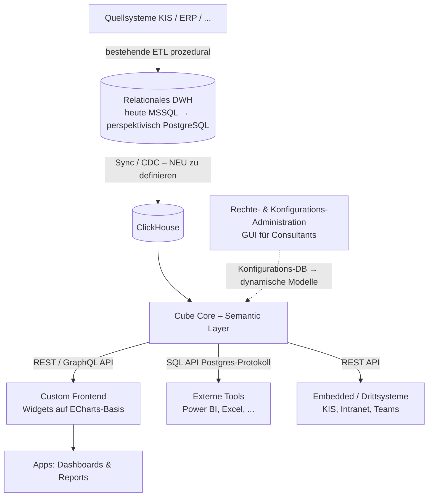
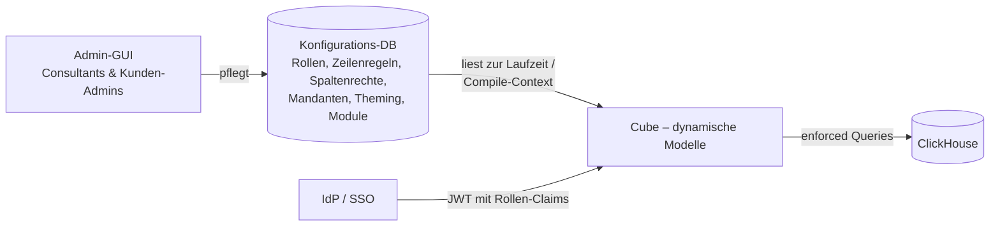
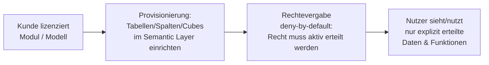

# Architekturansatz A – ClickHouse + Cube Core + Custom Frontend

> [!abstract] Kernidee
> Die bestehende SSAS-Cube-Struktur wird durch **ClickHouse** (lokal) als analytische Engine ersetzt. Darauf sitzt **Cube (Core / Open Source)** als Semantic Layer. Das **Frontend wird eigenentwickelt** (maximale Flexibilität), Visualisierungen basieren auf **Apache ECharts**. In der Applikation werden Datenmodelle (Cubes) verbunden, darauf Widgets definiert, die in Apps (Dashboards, Reports) komponiert und über eine API extern abrufbar sind. Ergänzend entsteht eine **anwenderfreundliche Rechte- und Individualisierungs-Administration**.

---

## 1 · Zielbild

### Schichten

### Verantwortlichkeiten je Schicht

| Schicht | Komponente | Verantwortung |
| --- | --- | --- |
| Datenhaltung (Quelle) | Relationales DWH (heute MSSQL, perspektivisch PostgreSQL) | System of Record; hier laufen die ETL-Prozesse mit prozeduraler Logik (T-SQL, künftig PL/pgSQL) |
| Analytische Engine | ClickHouse | Spaltenorientierte, performante Abfrage-Engine; ersetzt SSAS-Cubes |
| Semantik | Cube Core | Kennzahlen, Dimensionen, Berechnungslogik, Pre-Aggregationen, Caching, Rechte-Enforcement, API-Fassade |
| Präsentation | Custom Frontend + ECharts | Widgets, Apps (Dashboards/Reports), Designer, Kanäle |
| Administration | Eigenbau (GUI + Konfigurations-DB) | Rechteverwaltung für den Semantic Layer (Zeilen/Spalten), Mandanten-/CI-Konfiguration, Modulaktivierung – pflegt die Cube-Datenmodell-Konfiguration, bedienbar durch Consultants |

> [!info] Einordnung ins Pflichtenheft
> Der Schnitt entspricht dem geforderten Zugriffsprinzip aus [[API, Semantic Layer & Schnittstellen]]: Frontend sieht nur den Semantic Layer, nie das DWH. Die Ablösung der SSAS-Cubes ist explizit gefordert ([[Scope – In & Out of Scope]], „Ablösung statt Fortschreibung").

---

## 2 · Komponenten im Detail

### 2.1 ClickHouse als Abfrage-Engine

- Open Source (Apache 2.0), spaltenorientiert, extrem schnelle Aggregationen über große Datenmengen – passt zum Treiber „moderne Columnar-DBs" aus [[Markt & Timing]].
- Läuft als schlanker Single-Node on-prem (Container-fähig) und skaliert zu Clustern bzw. ClickHouse Cloud → unterstützt das geforderte **kleine Einstiegsprofil + SaaS-Option** ([[Betrieb, Performance & Compliance]]).
- **Eigenheiten:** append-optimiert; Updates/Deletes sind asynchrone Mutationen (teuer). Datenmodelle sollten eher **denormalisierte breite Tabellen** sein als klassische Star-Schemas mit vielen Joins. Das erfordert eine bewusste Modellierungsstrategie beim Übergang vom relationalen DWH.

### 2.2 Cube Core als Semantic Layer

- Open Source (Apache 2.0). Datenmodelle (Cubes, Measures, Dimensions, Joins, Hierarchien) als **Code (YAML/JS)** → Git-versionierbar, testbar, deploybar. Das ist eine starke Basis für das geforderte **versionierte Fachmodell** ([[Wettbewerbsvorteil & Fachmodell]]) und für „Standardmodell + kundenspezifische Erweiterung, update-sicher" (via `extends` und Compile-Context).
- **APIs:** REST, GraphQL, SQL API (PostgreSQL-Wire-Protokoll). Meta-API liefert maschinenlesbare Kennzahlen-/Dimensionsdefinitionen → Grundlage für Autocomplete, NLQ/KI ([[KI, Q&A & proaktive Analyse]]) und Kennzahl-Erklärungen (CALC-14).
- **Security:** Security Context + `queryRewrite` ermöglichen Row-Level-Security und Mandantentrennung zentral im Semantic Layer – kanalübergreifend, weil **alle** Konsumenten (eigenes Frontend, SQL API, Embedded) durch dieselbe Schicht gehen. Das deckt das Backend-Enforcement-Prinzip aus [[Rollen- & Berechtigungsmodell]].
- **Performance:** Pre-Aggregationen (Cube Store) + Caching adressieren die Zielwerte aus [[Performance & Antwortzeiten]] (< 0,5 s / ≤ 2 s / 5 s).
- **Multitenancy:** **eine ClickHouse-DB pro Mandant** (festgelegt 07/2026, F5) – physische Trennung je Kunde; Cube adressiert die mandantenspezifische DB über `COMPILE_CONTEXT`/Security Context. Details siehe Abschnitt 2.8.

### 2.3 Custom Frontend (Angular) + Chart Library

> [!success] Festlegungen (Stand 07/2026)
> **Angular ist gesetzt**, das **CGM-VIA-Design-System** ebenfalls (CGM-intern). VIA liefert jedoch **keine Chart-Komponenten** – es braucht eine eigenständige, mächtige und modern wirkende Chart Library, die sich in VIA-Tokens (Farben, Typografie, Abstände) einkleiden lässt.

- Eigenentwicklung gibt volle Kontrolle über **Widget-first-Architektur**, Interaktionstiefen (Ambient/Micro/Compact/Full), VIA-Konformität und **First-Class White-Labeling** ([[UI, UX & Design]], [[Architektur – Widgets, Kanäle & Integration]]).
- Widgets als gekapselte Komponenten (idealerweise **Angular Elements / Web Components**) → einbettbar in KIS, Intranet, Teams (Headless-Ansatz / EXP-15) und framework-neutral konsumierbar.

#### Chart-Library-Bewertung

| Kriterium                          | **Apache ECharts** (Vorschlag)                                                         | Highcharts                                        | amCharts 5    | D3.js                           | AG Charts              |
| ---------------------------------- | -------------------------------------------------------------------------------------- | ------------------------------------------------- | ------------- | ------------------------------- | ---------------------- |
| Lizenz                             | Apache 2.0, kostenfrei                                                                 | Kommerziell (pro Entwickler + OEM für Embedding!) | Kommerziell   | BSD, kostenfrei                 | Enterprise kommerziell |
| Chart-Vielfalt (VIS-01/04)         | Sehr hoch inkl. Custom Series (Gantt-artig)                                            | Sehr hoch                                         | Hoch          | Unbegrenzt, aber alles Eigenbau | Mittel–hoch            |
| Moderner Look / Animationen        | Sehr gut, voll themebar auf VIA-Tokens                                                 | Gut                                               | Sehr gut      | Abhängig vom Eigenbau           | Gut                    |
| Performance bei großen Datenmengen | Sehr gut (Canvas, progressive Rendering, Millionen Punkte)                             | Gut                                               | Mittel        | Abhängig                        | Gut                    |
| Angular-Integration                | `ngx-echarts` (etabliert)                                                              | `highcharts-angular`                              | vorhanden     | Eigenbau                        | vorhanden              |
| Barrierefreiheit (monochrom)       | **Decal-Muster** nativ (`aria.decal`) → [[UI, UX & Design]]-Anforderung direkt erfüllt | Muster möglich                                    | möglich       | Eigenbau                        | begrenzt               |
| SSR für PDF-Export                 | Ja (Node, seit 5.3)                                                                    | Ja (Export-Server)                                | eingeschränkt | Ja                              | eingeschränkt          |
| OEM-/Embedding-Risiko              | Keins                                                                                  | Hoch (OEM-Lizenz bei Weitergabe/Embedding nötig)  | vorhanden     | Keins                           | vorhanden              |

> [!tip] Einschätzung
> **ECharts bleibt die richtige Wahl**: technisch auf Augenhöhe mit den kommerziellen Optionen, ohne OEM-Lizenzfalle beim Embedding (kritisch fürs Plattform-/Widget-Geschäftsmodell und den [[Lizenzmodell-Potenzial|Widget Marketplace]]), mit nativer Monochrom-Unterstützung und SSR für den Report-Export. Der „moderne Look" entsteht durch ein **eigenes ECharts-Theme auf Basis der VIA-Design-Tokens** – einmal sauber gebaut, wirkt jede Visualisierung wie aus dem Design-System. **D3 punktuell ergänzend** für Spezialvisualisierungen, die ECharts nicht abdeckt.

#### Tabellen- & Pivot-Strategie (F7)

> [!success] Empfehlung (Stand 07/2026): zweigleisig, beide lizenzkostenfrei
> **Standard-Tabellen → TanStack Table (MIT, headless) + TanStack Virtual** · **Pivot/Matrix → FINOS Perspective (Apache 2.0)**

**1) TanStack Table + TanStack Virtual für alle Standard- und Berichtstabellen.**
Headless-Ansatz: die Bibliothek liefert die komplette Tabellen-Logik (Sortierung, Filter, Column Pinning/Sizing/Visibility, Grouping, Selektion), das Rendering gehört zu 100 % uns. Genau dadurch entsteht der „sehr moderne" Look – die Tabellen sind **native VIA-Komponenten**, kein fremdes Grid mit übergestülptem Theme. Offizieller **Angular-Adapter auf Signals-Basis** (`@tanstack/angular-table`), Virtualisierung für große Datenmengen über `@tanstack/angular-virtual` – deckt die Pflichtenheft-Vorgabe Paging/virtuelles Scrolling aus [[Performance & Antwortzeiten#Große Datenbestände]]. Kostenfaktor: einmaliger Bau der VIA-Tabellen-Komponente statt Lizenz – passt zur Design-System-Strategie („Zentrale Bausteine einmal als Standard-Komponenten bauen", [[UI, UX & Design#Konsistentes Design-System]]).

**2) FINOS Perspective für das interaktive Pivot-/Matrix-Widget (VIS-07).**
Echte Pivot-Engine (Group by Zeilen **und** Spalten, Aggregationen, Sub-/Grand-Totals, berechnete Ausdrücke), in C++/WASM – performant auch bei großen Ergebnismengen, Streaming-fähig, Apache-Arrow-Support. Als **Web Component** (`<perspective-viewer>`) verpackt → fügt sich direkt in die Widget-Architektur ein und ist per CSS/Theme auf VIA-Optik anpassbar. Stammt aus der FINOS-Foundation (Fintech-Umfeld), d. h. auf Governance und große Datenmengen ausgelegt.

**Architektur-Leitplanke für Perspective:** Perspective aggregiert **clientseitig** auf dem gelieferten Resultset. Das ist gewollt für explorative Ad-hoc-Pivots, darf aber die Semantikschicht nicht aushöhlen: Kennzahlen mit fachlicher Aggregationslogik (z. B. CM-Index, Quoten) kommen **fertig berechnet aus Cube**; Perspective darf nur additive Standard-Aggregationen (Summe, Anzahl, Min/Max, Ø) lokal bilden. Das entspricht exakt der Grenze aus CALC-13 ([[Zeit, Berechnungen & Kennzahlen]]) – die UI muss kenntlich machen, was lokal und was zentral berechnet ist. Größere Pivots jenseits des API-Zeilenlimits laufen über serverseitige Cube-Aggregation statt Rohdaten-Download.

**Fallback:** Reicht der Perspective-Funktionsumfang fachlich nicht (z. B. sehr spezifische Report-Matrix-Layouts), bleibt **AG Grid Enterprise** die kommerzielle Rückfalloption – Lizenzmodell pro Entwickler mit unbegrenztem Deployment (keine Kosten pro Kunde/Endnutzer), also planbar und ohne OEM-Falle. Zunächst nicht nötig.

|             | TanStack Table              | FINOS Perspective                | AG Grid Enterprise *(Fallback)*               |
| ----------- | --------------------------- | -------------------------------- | --------------------------------------------- |
| Lizenz      | MIT, kostenfrei             | Apache 2.0, kostenfrei           | Kommerziell (pro Entwickler, Deployment frei) |
| Rolle       | Standard-/Berichtstabellen  | Pivot/Matrix, Ad-hoc-Exploration | Rückfalloption Pivot/Grid                     |
| Look        | 100 % VIA (headless)        | Theming per CSS auf VIA          | Themes, begrenzt anpassbar                    |
| Pivot       | – (nur Grouping)            | ✅ Zeilen+Spalten, Totals         | ✅                                             |
| Große Daten | Virtual Scrolling           | WASM + Arrow, Streaming          | Server-Side Row Model                         |
| Angular     | Offizieller Signals-Adapter | Web Component                    | Offiziell                                     |

#### Embedding-Strategie (F9)

> [!success] Festlegung (Stand 07/2026)
> Extern eingebettet werden **fertig konfigurierte Widgets** (z. B. ein Chart) – als **Web Component** und alternativ per **iFrame**. Die **Daten-API liefert Cube ohnehin** (REST/GraphQL/SQL). Gerenderte Artefakte (PNG/PDF via API) sind **nicht erforderlich**.

Konsequenzen für die Widget-Architektur:

- **Web Component als Primärweg:** Widgets werden als **Angular Elements** paketiert und über ein versioniertes Script-Bundle ausgeliefert (`<hbi-widget widget-id="..." token="...">`). Konfiguration (Widget-ID, Filterkontext, Theme) läuft über Attribute – das Host-System braucht kein Angular. Damit ist die im Pflichtenheft geforderte Einbettung in KIS, Intranet und Portale ([[Architektur – Widgets, Kanäle & Integration#Embedded Analytics (Headless-Ansatz)]], EXP-15) direkt bedient.
- **iFrame als einfacher Zweitweg:** Für Host-Systeme, die kein Script einbinden können/dürfen (strenge CSP, Legacy-Portale, Teams-Tabs), rendert eine Embed-Route dasselbe Widget isoliert im iFrame. Gleiches Widget, gleiche Rechte – nur anderer Träger.
- **Auth im Embedded-Kontext:** Das Host-System holt serverseitig ein **kurzlebiges, signiertes Embed-Token** (JWT mit Security Context: Nutzer/Rolle/Mandant) und übergibt es dem Widget. Cube enforced damit Zeilen-/Spaltenrechte identisch zum Hauptfrontend – keine Cookies, keine Cross-Site-Probleme; erfüllt die Pflichtenheft-Vorgabe, dass Authentifizierung, Theming und Rechteprüfung auch eingebettet vollständig greifen.
- **Theming & White-Labeling:** VIA als Default; Mandanten-Theme wird über das Token bzw. Attribute aufgelöst (CSS Custom Properties) – CI-Theming über alle Kanäle gemäß [[Rollen- & Berechtigungsmodell#CI / Branding (Mandantenfähigkeit)]].
- **Absicherung:** `frame-ancestors`-Allowlist je Mandant (Clickjacking-Schutz, [[Sicherheit & Zugriffsschutz#Schutz gegen Web-Angriffe]]), kurze Token-Laufzeiten mit Renewal, versionierte Embed-Bundles (Semver) für rückwärtskompatible Updates.
- **Nebeneffekt:** Der Web-Component-Schnitt beantwortet zugleich den offenen Punkt aus F6 – Widgets werden ohnehin framework-neutral paketiert.

### 2.4 Datenschicht-Evolution: MSSQL → PostgreSQL

> [!info] Festlegung (Stand 07/2026)
> Die ETL-Prozesse benötigen weiterhin eine relationale DB mit prozeduraler Logik. Das relationale DWH bleibt daher als **Verarbeitungs- und System-of-Record-Schicht** bestehen; ClickHouse ist die **analytische Serving-Schicht**, kein DWH-Ersatz. Langfristig wird MSSQL voraussichtlich durch **PostgreSQL** abgelöst.

Implikationen:

- **Lizenzkosten-Hebel:** Der Wegfall von MSSQL-Lizenzen pro Installation stärkt das geforderte kleine, wirtschaftliche Einstiegsprofil ([[Betrieb, Performance & Compliance]]) und macht den Gesamtstack vollständig Open Source – konsistent mit Stärke S1.
- **Besserer Sync-Pfad:** Für PostgreSQL → ClickHouse existiert mit **PeerDB** (von ClickHouse Inc. übernommen, Open Source; in ClickHouse Cloud als ClickPipes) ein nativer CDC-Weg über logische Replikation. Das entschärft Risiko R3 deutlich gegenüber der MSSQL-Ausgangslage und macht „nahezu Echtzeit" realistisch. Übergangsweise (solange MSSQL läuft) braucht es Batch-Loads oder Debezium-CDC.
- **Eigene Migration:** T-SQL → PL/pgSQL ist ein substanzielles eigenes Vorhaben (Dialekt-Unterschiede, Tooling teils vorhanden). Sie ist **nicht Teil dieses Architekturvorhabens**, muss aber im Programm sequenziert werden – zwei Großmigrationen parallel (SSAS→Cube **und** MSSQL→Postgres) erhöhen das Programmrisiko (→ F2, Sequenzierung).
- **Entkopplung als Schutz:** Da Cube ausschließlich gegen ClickHouse modelliert, ist die Semantik-/Frontend-Schicht vom DB-Wechsel darunter **vollständig entkoppelt** – die Plattform kann vor, während oder nach der Postgres-Migration gebaut werden. Neue ETL-Logik sollte ab sofort möglichst **dialekt-arm bzw. portabel** geschrieben werden.

### 2.5 Rechte- & Konfigurations-Administration für den Semantic Layer (Eigenbau)

> [!success] Präzisierung (Stand 07/2026)
> Die Rechteverwaltung bezieht sich auf **Cube (Semantic Layer)**, nicht auf ClickHouse. ClickHouse läuft als geschlossene interne Engine; sämtliches Enforcement geschieht in Cube. Benötigt wird eine **GUI, mit der Consultants (nicht-technisch) kundenindividuelle Zeilen- und Spaltenrechte konfigurieren** – das Tool pflegt im Ergebnis die Datenmodell-Konfiguration von Cube.

#### Empfohlenes Umsetzungsmuster: Konfigurationsspeicher statt Code-Generierung

Zwei grundsätzliche Wege, wie eine GUI Cube konfigurieren kann:

| Muster | Funktionsweise | Bewertung |
| --- | --- | --- |
| **(a) Code-Generierung** | GUI schreibt/ändert YAML-/JS-Modelldateien pro Kunde | ❌ Erzeugt kundenindividuellen Code → verletzt [[Leitprinzipien#Konfiguration statt Code]], Update-Konflikte, Git-Handling für Consultants |
| **(b) Konfigurationsspeicher + dynamische Modelle** *(empfohlen)* | Rechte- und Individualisierungs-Konfiguration liegt in einer **Konfigurations-DB**. Die Cube-Modelle sind **dynamisch/templatisiert** und lesen diese Konfiguration aus: Zeilenrechte zur Laufzeit über `queryRewrite` + Security Context (JWT-Claims → Filterregeln), Spalten-/Kennzahlrechte über dynamische Member-Sichtbarkeit im Compile-Context. Die GUI editiert **nur den Konfigurationsspeicher**, nie Code. | ✅ Standardmodell bleibt unangetastet und update-sicher; Kundenkonfiguration überlebt jedes Produkt-Update; exakt das Pflichtenheft-Prinzip |

#### Fachliches Rechtemodell in der GUI

Die GUI bildet das Modell aus [[Rollen- & Berechtigungsmodell]] direkt ab. **Grundprinzip: „Recht muss aktiv erteilt werden"** – ohne explizite Zuweisung sieht/kann ein Nutzer nichts (deny-by-default, deckt die restriktive Datenrolle des Pflichtenhefts).

- **Datenrollen** (restriktiv, Union bei Mehrfachzuweisung): Zeilenregeln entlang der Semantic-Layer-Dimensionen (z. B. Fachabteilung = Innere Medizin, Standort = Haus A) – per Dimension-Picker statt Formelsprache.
- **Spalten-/Kennzahlrechte**: Sichtbarkeit einzelner Measures/Dimensionen je Rolle (z. B. Personalkosten nur für KFM/GF).
- **Funktionale Rollen** (additiv): leben in der Applikationsschicht (was darf der Nutzer *tun*), werden aber in derselben GUI verwaltet. Dazu gehören insbesondere **Gestaltungsrechte** wie „Widgets erstellen/bearbeiten" – das ist ein privilegiertes Recht für BI-Designer/Power-User, nicht für jeden Nutzer (vgl. [[Zielgruppen & Nutzerrollen#Full / Systemrollen]]).
- **Zuordnung IdP-Gruppen → Rollen**, damit SSO-Gruppen automatisch die richtigen Rechte ergeben.

#### Lizenzierung → Provisionierung → Rechtevergabe (Reihenfolge)

Module/Fachmodelle werden **zentral vom Produktteam** gepflegt (code-basiert, versioniert) und an Kunden ausgerollt. Der kundenseitige Ablauf ist eine feste Kette:

1. **Lizenzierung** eines Moduls/Modells schaltet dessen Bestandteile frei (Lizenzschlüssel, vgl. [[Skalierbarkeit, Deployment & Lizenzierung#Lizenzierung]]).
2. **Provisionierung**: Die zum Modul gehörenden **Tabellen, Spalten und Cubes werden im Semantic Layer eingerichtet/aktiviert** – gesteuert über die Modulaktivierung in der Konfigurations-DB, nicht durch manuelles Modell-Editieren.
3. **Rechtevergabe** erst danach, strikt nach dem Prinzip **„Recht muss aktiv erteilt werden"**: Das bloße Vorhandensein einer lizenzierten Tabelle gibt noch niemandem Zugriff – Zeilen-, Spalten- und Funktionsrechte werden explizit zugewiesen.

> [!info] Zusammenspiel Lizenz vs. Recht
> Lizenz = „existiert dieses Modul beim Kunden überhaupt?". Recht = „darf dieser konkrete Nutzer etwas davon sehen/tun?". Beide Bedingungen müssen erfüllt sein. Das trennt kommerzielle Freischaltung sauber von der Zugriffskontrolle.

#### Semantic Layer als Single Point of Truth der Rechte

> [!important] Durchreichen statt Nachbauen
> **Widgets reichen die Nutzeridentität (das Embed-/Session-Token mit Security Context) in den Semantic Layer durch** und führen **keine eigene Rechtelogik**. Damit ist Cube der **Single Point of Truth auch für Rechte**: Jede Datenanfrage – egal ob Hauptfrontend, eingebettetes Widget, Export oder externes Tool – wird an derselben Stelle geprüft. Ein Widget kann nie mehr Daten anzeigen, als der durchgereichte Nutzer im Semantic Layer sehen darf.

Daraus folgt eine klare **Zwei-Ebenen-Trennung der Berechtigung**:

| Ebene | Was wird berechtigt | Wo enforced |
| --- | --- | --- |
| **Daten-Ebene** | Welche Zeilen/Spalten/Kennzahlen ein Nutzer sehen darf | **Semantic Layer (Cube)** – durchgereicht durch Widgets, kanalübergreifend |
| **App-Ebene** | Zugriff auf ein **Dashboard**/eine App als Ganzes; Gestaltungsrechte (Widgets erstellen) | **Applikationsschicht** – unabhängig, zusätzlich |

Dashboards können also **unabhängig** berechtigt werden (wer darf dieses Dashboard öffnen), während die darin liegenden Widgets ihre Daten weiterhin über den durchgereichten Nutzer aus dem Semantic Layer beziehen. **Beide Ebenen greifen additiv**: Ein Nutzer mit Dashboard-Zugriff sieht darin nur die Datenausschnitte, die seine Datenrolle im Semantic Layer zulässt – ein leeres oder teilbefülltes Dashboard ist ein legitimer, gewollter Zustand.

#### Notwendige GUI-Fähigkeiten (über CRUD hinaus)

- **„Anzeigen als…"-Vorschau**: Consultant prüft vor Freigabe, was ein Nutzer mit Rolle X tatsächlich sieht (Zeilen & Spalten) – essenziell, da Datenrollen restriktiv sind und Fehler sonst erst beim Kunden auffallen.
- **Audit-Ansicht („wer kann was sehen")** – *gesetzt (07/2026)*: auswertbare Ist-Sicht über die effektiven Berechtigungen, in beide Richtungen navigierbar: (a) je **Nutzer/Rolle** → welche Zeilen (Dimensionsausschnitte) und Spalten (Measures/Dimensionen) sind sichtbar; (b) je **Datenobjekt** (z. B. Kennzahl „Personalkosten") → wer hat darauf Zugriff. Berücksichtigt die Union-Semantik mehrerer Datenrollen und ist exportierbar (Nachweis für Datenschutzbeauftragte/Revision).
- **Audit-Log („wer hat wann was geändert")** – *gesetzt (07/2026)*: unveränderliches Protokoll aller Konfigurationsänderungen mit Zeitstempel, Akteur, Objekt, Alt-/Neu-Wert; erfüllt die Auditanforderung aus [[Sicherheit & Zugriffsschutz#Protokollierung (Audit)]] und ermöglicht Rollback auf frühere Konfigurationsstände.
- **Validierung**: Konfliktprüfung (z. B. leere Ergebnismengen, widersprüchliche Regeln) vor Aktivierung. Ein Freigabe-Workflow (Vier-Augen-Prinzip) ist **zunächst nicht erforderlich** – die Architektur sollte ihn aber als spätere Ausbaustufe nicht verbauen (Änderungen als Ereignisse modellieren, dann ist ein vorgeschalteter Approval-Schritt nachrüstbar).
- **Mandantenkontext**: Konfiguration strikt je Mandant, mit kopierbaren Vorlagen (Standard-Rollensets als Teil der Fachmodule).
- **Zwei Nutzergruppen einplanen** – *gesetzt (07/2026)*: primär **Consultants**, später voraussichtlich auch **Kunden-Admins**. Konsequenz für das Design von Anfang an: rollengetrennte GUI-Berechtigungen (wer darf welche Konfigurationsbereiche ändern), sichere Defaults, Guardrails/Validierung auf „Kunden-Admin-Niveau" statt Expertenmodus, verständliche Sprache statt Cube-Terminologie. Das deckt zugleich die Pflichtenheft-Vorgabe [[UI, UX & Design#Anpassung über die Oberfläche]].

> [!note] Wirkung auf R2
> Dieses Muster löst das Spannungsfeld „Konfiguration statt Code" für **Rechte & Individualisierung** vollständig auf. Die Pflege des **Standard-Fachmodells** erfolgt code-basiert durch das Produktteam (F3). Kundenseitige **Modell-Erweiterungen** (eigene Tabellen/Spalten) sind zusätzlich vorgesehen – als klar getrennte Schicht, siehe Abschnitt 2.7.

### 2.7 Kundenseitige Modell-Erweiterungen (Custom Tables & Columns)

> [!success] Anforderung (Stand 07/2026)
> Kunden sollen den Semantic Layer / die ClickHouse-Modelle um **eigene Tabellen und Spalten erweitern** können, die **nicht mitgeliefert** werden (kundenspezifische Zusatzdaten, eigene Kennzahlen auf eigenen Quellen).

Das ergänzt F3: Das **Standardmodell** bleibt Produktteam-Hoheit (code-basiert, ausgerollt), **daneben** entsteht eine kundeneigene Erweiterungsschicht. Entscheidend ist die **strikte Trennung beider**, damit Produkt-Updates die Kundenerweiterungen nie überschreiben und Kundenerweiterungen nie das Standardmodell beschädigen.

#### Zwei-Schichten-Modell des Fachmodells

| Schicht | Herkunft | Pflege | Update-Verhalten |
| --- | --- | --- | --- |
| **Standard-Fachmodell** | Produktteam, mitgeliefert | Code (Git), versioniert | Wird bei Produkt-Updates ersetzt/migriert |
| **Custom-Erweiterung** | Kunde | über Konfigurations-GUI / definierten Namespace | Bleibt bei Produkt-Updates unangetastet |

**Technischer Ansatz:**

- **Eigener Namespace/Ordner** für Custom-Cubes (z. B. `custom/`), der bei Updates nicht überschrieben wird. Cube lädt Standard- **und** Custom-Modelle in denselben Kontext; Erweiterungen können Standard-Cubes via `extends` ergänzen oder als eigenständige Cubes auf eigene ClickHouse-Tabellen zeigen.
- **Eigene ClickHouse-Tabellen** in der Mandanten-DB (F5 macht das sauber: die Erweiterung lebt physisch in der kundeneigenen DB, kein Konflikt mit anderen Mandanten). Befüllung über Excel-/Datei-Import ([[Excel-Integration]] (d)) oder eigene Ladestrecken.
- **Naming-/Kollisionsschutz:** reservierte Präfixe für Custom-Objekte, damit ein künftiges Standardmodell nie einen Namen belegt, den ein Kunde bereits nutzt – verhindert Update-Konflikte.
- **Verwaltung über die GUI** (konsistent mit 2.5): Anlegen von Custom-Tabellen/-Spalten und einfachen berechneten Feldern über die Oberfläche; die GUI schreibt in den Konfigurationsspeicher / Custom-Namespace, nicht in den Produkt-Code.

#### Verhältnis zu den Kernprinzipien – zu wahrende Grenzen

> [!warning] Semantik bleibt Single Point of Truth
> Auch Custom-Erweiterungen laufen **durch den Semantic Layer** – kein direkter ClickHouse-Zugriff am Semantic Layer vorbei. Damit gelten Rechte-Enforcement (Zeilen/Spalten, deny-by-default), Audit und kanalübergreifende Konsistenz **auch für Kundenerweiterungen**. Eine Custom-Spalte ist ein vollwertiges, berechtigbares Semantik-Objekt, kein Seiteneingang.

- **Governance-Abstufung:** Standard-Kennzahlen sind validiert/zertifiziert; Custom-Objekte sind kundenverantwortet. Die UI sollte beide **sichtbar unterscheiden** (Datenvertrauen / Herkunft, vgl. [[UI, UX & Design#Datenvertrauen]] und CALC-13), damit ein selbst gebautes Feld nicht fälschlich wie eine zertifizierte Standardkennzahl wirkt.
- **Wer darf erweitern:** ein privilegiertes Recht (BI-Designer/Power-User bzw. Kunden-Admin), nicht jeder Nutzer – reiht sich in das Rechtemodell aus 2.5 ein.
- **Support-/Betriebsgrenze:** Fehler in Custom-Modellen dürfen das Standardmodell und den Betrieb nicht destabilisieren – Validierung beim Speichern, Fehlerisolierung, klare Zuständigkeit (Kunde verantwortet seine Erweiterungen).
- **Migrationssicherheit:** Da Custom-Objekte in eigenem Namespace + eigener DB liegen (F5), überstehen sie Produkt-Updates und Modell-Rollouts unverändert – dieselbe Update-Sicherheits-Logik wie bei der Rechte-Konfiguration (2.5).

> [!note] Abgrenzung
> Kundenerweiterung = **eigene Daten + einfache abgeleitete Kennzahlen** auf eigener Basis. Das Erweitern/Verbiegen der **zertifizierten Standard-Fachlogik** (z. B. Neudefinition des CM-Index) bleibt bewusst außen vor – sonst erodiert die „Semantik existiert genau einmal"-Garantie ([[Leitprinzipien#Semantik & Fachlogik]]). Grenzfall für F3-Nachtrag: Wie weit dürfen Custom-Berechnungen auf Standard-Measures aufsetzen?

### 2.8 Multi-Tenancy: eine ClickHouse-DB pro Mandant

> [!success] Festlegung (Stand 07/2026, F5)
> Jeder Mandant erhält eine **eigene ClickHouse-Datenbank** (physische Isolation). Cube löst pro Request über den Security Context (Tenant-Claim im JWT) die zugehörige Datenbank/Connection auf; das Standard-Fachmodell wird je Mandant gegen dessen DB instanziiert.

**Warum diese Variante (statt Shared Tables + Tenant-Spalte):**

- **Stärkste Isolation:** Kein Risiko, dass ein Filterfehler mandantenfremde Zeilen offenlegt – die Trennung liegt physisch unter der Query, nicht nur in einer WHERE-Bedingung. Direkter Rückhalt für die Pflichtenheft-Vorgabe „Daten verschiedener Mandanten strikt getrennt" ([[Sicherheit & Zugriffsschutz#Mandantentrennung]]).
- **C5 / DSGVO Art. 9:** Physische Trennung ist gegenüber Datenschutzbeauftragten und im C5-Kontext deutlich leichter nachweisbar ([[Datenschutz & Rechtliche Vorgaben]]) – ein starkes Argument im deutschen Gesundheitswesen.
- **On-Prem-Kongruenz:** On-Prem läuft ein Kunde ohnehin allein auf seiner DB. „DB pro Mandant" macht **On-Prem und SaaS strukturgleich** – dieselbe Architektur, nur einmal vs. mehrfach deployed. Das stützt „eine Produktlogik für on-prem und SaaS" ([[Betrieb, Performance & Compliance]]).
- **Backup/Restore, Migration, Sunset je Kunde:** Einzelne Mandanten lassen sich sichern, umziehen, löschen oder auf eine neue Modellversion heben, ohne andere zu berühren.
- **Noisy-Neighbor-Entkopplung:** Lastspitzen eines großen Klinikverbunds treffen nicht die DB der anderen.

**Kosten / zu beachten:**

- **Betrieb skaliert mit Mandantenzahl:** Provisionierung, Migrationen und Monitoring müssen **automatisiert** über alle Mandanten-DBs laufen (Migrations-Runner, der jede DB durchläuft). Manuell wäre es ab ~Dutzend Mandanten untragbar – gilt als Anforderung an die Provisionierungs-Automatisierung.
- **Schema-Drift vermeiden:** Alle Mandanten-DBs müssen auf konsistenten Modell-/Schema-Versionen bleiben; die Rollout-Mechanik (F3-Provisionierungskette) muss Versionsstände je Mandant tracken.
- **Cross-Mandanten-Auswertungen** (Träger-/Verbundleitung, [[Zielgruppen & Nutzerrollen]]) sind mit getrennten DBs **nicht mehr per einfachem Query** möglich – sie brauchen eine bewusste Aggregationsschicht (z. B. eigene Konsolidierungs-DB oder ClickHouse-Distributed/`remote()`-Abfragen). → offener Detailpunkt (F5-Nachtrag).
- **Ressourcen-Overhead pro DB** ist bei ClickHouse gering (kein schwergewichtiger Instanz-Overhead je DB), aber sehr viele sehr kleine Mandanten sollten Storage-seitig beobachtet werden.
- **Connection-/Pooling-Strategie in Cube:** dynamische Datenquellen-Auflösung je Tenant sauber cachen, damit nicht pro Request neu verbunden wird.

> [!note] Verhältnis zu F8
> Die Wahl ist unabhängig von exakten Skalierungszahlen tragfähig, weil sie on-prem wie SaaS gleich funktioniert. F8 (Zielgrößen) beeinflusst nur, **ob mehrere Mandanten-DBs auf einem ClickHouse-Cluster koexistieren** oder auf getrennte Cluster verteilt werden – eine Deployment-, keine Architekturfrage. Zudem beheimatet die Mandanten-DB auch die kundeneigenen Erweiterungstabellen (Abschnitt 2.7).

---

## 3 · Bewertung

### 3.1 Stärken

| # | Stärke | Wirkung |
| --- | --- | --- |
| S1 | Vollständig Open-Source-Basisstack (Apache 2.0) | Keine Runtime-Lizenzkosten pro Kunde, volle Kontrolle, kein Vendor-Lock-in auf Tool-Ebene → stützt [[Geschäftsmodell – Plattform statt Projekt]] und das [[Lizenzmodell-Potenzial]] (eigene Wertschöpfung statt Fremdlizenz-Weitergabe) |
| S2 | Semantic Layer als eigenständige Schicht mit API-Fassade | Exakt das geforderte Architekturprinzip „Frontend sieht nur den Semantic Layer" ([[API, Semantic Layer & Schnittstellen]]); externe Tools konsumieren dieselbe Semantik (Shared Semantic Infrastructure) |
| S3 | Fachmodell als versionierter Code | Git-Workflow, Code-Review, automatisierte Tests des Fachmodells; Standardmodell zentral pflegbar, Kundenextensions update-sicher via `extends` – passt zum Knowledge Flywheel |
| S4 | Performance-Architektur | ClickHouse + Pre-Aggregationen sind für die Zielwerte (≤ 2 s Standard) realistisch dimensioniert, auch bei klinikweitem Jahres-Reporting |
| S5 | Deployment-Flexibilität | Alle Komponenten containerisierbar; On-Prem-Single-Node bis Cloud-Cluster aus einer Produktlogik; Frontend zustandslos und unabhängig releasebar |
| S6 | Maximale Frontend-Flexibilität | Widget-first, Interaktionstiefen, White-Labeling, Design-System-Konformität ohne Kompromisse eines Fremd-BI-Frontends |
| S7 | KI-Readiness | Cube-Meta-API = maschinenlesbare Semantik → belastbare Grundlage für NLQ, Insights, Erklärungen ([[Leitprinzipien#AI als Instrument, nicht als Selbstzweck]]) |
| S8 | Klarer SSAS-Ablösungspfad | Erfüllt die Out-of-Scope-Vorgabe „SSAS-Ablösung statt Fortschreibung"; Fachlogik wandert aus Stored Procedures in versionierte Cube-Modelle |

### 3.2 Schwächen & Risiken

| # | Risiko | Beschreibung | Schwere |
| --- | --- | --- | --- |
| R1 | **Excel-Live-Zugriff (XMLA)** | [[Excel-Integration]] nennt XMLA als empfohlenen Standard; Cube **Core** bietet keine MDX-/XMLA-/OData-API (kommerzielle Cube-Cloud-Features). **Entschärft (07/2026):** XMLA ist als „gut, aber verzichtbar" eingestuft. Basis-Excel-Anbindung über Export-Endpunkte (.xlsx) + ggf. SQL API/ODBC; XMLA bleibt Option für später (Kommerzlizenz oder Eigenbau-Add-in), falls Kundennachfrage es rechtfertigt. | 🟡 mittel (herabgestuft) |
| R2 | **„Konfiguration statt Code" vs. Code-basierte Modelle** | Cube-Modelle sind Code; das Pflichtenheft fordert Anpassungen vollständig über die Oberfläche. **Aufgelöst (07/2026):** Fachmodell-Pflege bewusst code-basiert durchs Produktteam (F3); kundenindividuelle Rechte & Individualisierung über Konfigurations-DB + Consultant-GUI (Abschnitt 2.5). Klare Trennung, kein Widerspruch mehr. | 🟢 niedrig (aufgelöst) |
| R3 | **Doppelte Datenhaltung DWH → ClickHouse** | Neue Sync-Strecke (Batch/CDC) nötig: Latenz („nahezu Echtzeit ad-hoc"), Konsistenz, Monitoring, Freshness-Indikatoren, doppelter Storage- und Betriebsaufwand on-prem. ClickHouse-gerechte (denormalisierte) Modellierung ist Zusatzarbeit. **Mit PostgreSQL als Quelle entschärft** (PeerDB-CDC, siehe 2.4); für die MSSQL-Übergangsphase bleibt es Eigenkonzept. | 🟠 mittel (mit Postgres) |
| R4 | **Eigenbau-Umfang unterschätzbar** | Nicht durch den Stack abgedeckt und komplett selbst zu bauen: Event-/Subscription-Engine (Push, Alerts, Abos – [[Leitprinzipien#Push statt Pull]]), Report-Engine (PDF/Excel-Rendering mit CI, Berichtsmappen, Paginierung, Rechteprüfung beim Rendern), Kollaboration (Kommentare, Status, Versionierung), Datenkatalog/Lineage, Audit-Logging, Lizenzschlüssel-Mechanik, Onboarding/Hilfe, NLQ/KI-Assistent, native Mobile-App. | 🔴 hoch (Aufwand, nicht Machbarkeit) |
| R5 | **Tabellen/Pivots sind kein ECharts-Thema** | VIS-07 und große Tabellen brauchen separate Komponenten. **Gelöst (07/2026):** TanStack Table (MIT, headless, VIA-nativ) für Standard-Tabellen + FINOS Perspective (Apache 2.0) für Pivot/Matrix; AG Grid Enterprise nur als Rückfalloption. Restrisiko: Eigenbau-Aufwand der VIA-Tabellen-Komponente und Governance der clientseitigen Aggregation (CALC-13-Grenze). | 🟢 niedrig (gelöst) |
| R6 | **Cube Core Feature-Grenzen** | Visual Modeler, MDX/DAX-API, Chart-Prototyping u. a. liegen in Cube Cloud (kommerziell). Abhängigkeit von der Roadmap eines VC-finanzierten Anbieters; Fork-Fähigkeit vorhanden (Apache 2.0), aber mit Wartungslast. | 🟡 mittel |
| R7 | **Member-Level-Security (Spaltenebene)** | [[Sicherheit & Zugriffsschutz]] fordert Berechtigungen auf drei Ebenen (Funktion, **Spalte**, Zeile). Kein fertiges Cube-Core-Feature; Lösung über dynamische Member-Sichtbarkeit im Compile-Context, gespeist aus der Konfigurations-DB (Abschnitt 2.5). Konzept steht, technischer Nachweis im PoC nötig. | 🟡 mittel |
| R8 | **Betriebskomplexität on-prem** | Stack aus MSSQL + ClickHouse + Cube (+ Cube Store) + eigenen Services + Frontend: mehr bewegliche Teile als heute; Klinik-IT-Tauglichkeit (Citrix, Proxy, Updates) muss durch Paketierung (Container/Installer) erkauft werden. | 🟡 mittel |
| R9 | **Migrationsaufwand Fachlogik** | Bestehende MDX-/Stored-Procedure-Logik muss in Cube-Modelle übersetzt und fachlich validiert werden (Parallelbetrieb/Vergleichsrechnung im Strangler-Fig-Modus, [[Migration & Koexistenz]]). | 🟠 mittel–hoch |

---

## 4 · Abgleich mit dem Pflichtenheft

Legende: ✅ gut abgedeckt · 🟡 abgedeckt mit Eigenbau/Konzeptarbeit · 🔴 Lücke im vorgeschlagenen Stack

| Pflichtenheft-Bereich | Bewertung | Anmerkung |
| --- | --- | --- |
| Semantik als Single Point of Truth, versioniert ([[Voraussetzung – Semantische Schicht]]) | ✅ | Cube-Modelle versioniert (Git); Laufzeit-Sichtbarkeit von Version/Definition (CALC-14, Datenvertrauen) ist Eigenbau auf Meta-API |
| Frontend ohne Fachlogik, nur API-Zugriff | ✅ | Architektonisch erzwungen |
| Widget-first, kanalagnostisch, Interaktionstiefen | ✅/🟡 | Volle Freiheit durch Eigenbau; Web-Component-Strategie früh festlegen |
| Embedded Analytics / Headless (EXP-15) | ✅/🟡 | Festgelegt: Web Components (Angular Elements) + iFrame mit Embed-Token; Konzept steht (Abschnitt 2.3), Umsetzung Eigenbau |
| Externe Tools auf derselben Semantik (Power BI, Excel) | 🟡 | Power BI: via SQL API (Postgres-Connector) eingeschränkt möglich; Excel zunächst über .xlsx-Export; XMLA/OData als spätere Ausbaustufe (F4 beantwortet) |
| Rollen-/Rechtemodell, RLS kanalübergreifend, Backend-Enforcement | ✅/🟡 | Cube Security Context trägt das Modell; Widgets reichen Nutzer durch → Cube = SPOT auch für Rechte; deny-by-default; Dashboard- vs. Daten-Ebene getrennt (Abschnitt 2.5); Admin-UI = Eigenbau |
| Konfiguration statt Code (kundenseitig) | ✅ | Aufgelöst (F3): Standard-Fachmodell code-basiert durchs Produktteam + Lizenz-Provisionierung; kundenindividuelle Rechte/Individualisierung sowie **eigene Tabellen/Spalten** (Abschnitt 2.7) über GUI/Custom-Namespace |
| Mandantenfähigkeit + CI/White-Labeling | ✅/🟡 | **DB pro Mandant** (F5, Abschnitt 2.8) → physische Isolation, C5-freundlich; eigenes Theming-System (Eigenbau); Cross-Mandanten-Konsolidierung als Detailpunkt offen |
| Push statt Pull / Alerting / Abos | 🔴→🟡 | Nicht im Stack enthalten – **kompletter Eigenbau** (Event- & Subscription-Engine); architektonisch aber gut andockbar (Cube-Queries als Schwellwert-Prüfungen) |
| Berichtswesen: PDF/Excel, Berichtsmappen, zeitgesteuert (EXP-01…14) | 🟡 | Eigenbau: Headless-Rendering (SSR-ECharts + HTML→PDF), Scheduler, Abo-Verwaltung, Rechteprüfung beim Rendern |
| Visualisierungen (VIS-01…08) | ✅ | ECharts (Charts) + TanStack Table (Tabellen) + Perspective (Pivot, VIS-07); Monochrom via Decals ✅ |
| Filter, Drill, Deep Links (FIL-01…17) | 🟡 | Cube unterstützt Hierarchien/Drill-Member; Cross-Filtering, Drill-Cross-Detail, Filter-Clipboard, Undo = Frontend-Eigenbau |
| Berechnete Felder im UI (CALC-01…16) | 🟡 | Lokale Berechnungen im Frontend erlaubt; Abgrenzung lokal vs. zentral (CALC-13) sauber designen, damit Semantik-Prinzip nicht erodiert |
| KI: NLQ, Insights, Why, Prognose (KI-01…19) | 🟡 | Meta-API als Fundament ✅; NLQ-Pipeline, EU-gehostetes LLM, Erklärbarkeit, Prognosemodelle = Eigenbau |
| Performance-Ziele | ✅ | ClickHouse + Pre-Aggs realistisch; RUM (Real User Monitoring) ergänzen |
| Deployment on-prem / SaaS / BYOC, kleines Einstiegsprofil | ✅ | Container-Stack; SaaS-Mandantenkonzept ausarbeiten |
| C5 / DSGVO Art. 9 / EU-Hosting | ✅/🟡 | DB pro Mandant (F5) stützt physische Trennung als C5-/DSGVO-Nachweis; Stack OSS/selbst gehostet (Vorteil ggü. US-SaaS); Nachweislast im Betrieb; Audit-Logging = Eigenbau |
| Sicherheit (SSO OIDC/SAML, JWT, CSP, Audit) | 🟡 | Cube akzeptiert JWT nativ; IdP-Integration, Session-Handling, Audit = Eigenbau nach Standardmustern |
| Konfiguration statt Code (kundenseitig) | ✅ | Aufgelöst (F3): Fachmodell code-basiert durchs Produktteam; kundenindividuelle Rechte/Individualisierung über GUI – Zeile oben |
| Module einzeln lizenzierbar/aktualisierbar, Lizenzschlüssel | ✅/🟡 | Kette Lizenz → Provisionierung (Tabellen/Spalten im Semantic Layer) → Rechtevergabe festgelegt (Abschnitt 2.5); Modul = Cube-Modell-Paket + Widget-/Report-Bundle + Lizenz-Flag; Mechanik = Eigenbau |
| Mehrsprachigkeit, Barrierefreiheit | 🟡 | Volle Kontrolle durch Eigenbau; von Anfang an einplanen (i18n, Tastatur, Kontrast) |
| Native Mobile-App (Alerting) | 🔴→🟡 | Separates Projekt; API-first-Architektur macht es möglich |
| Strangler-Fig-Migration | 🟡 | Parallelbetrieb SSAS/Cube mit Vergleichsrechnungen einplanen (R9) |

---

## 5 · Was sich mit dem Ansatz (so) nicht umsetzen lässt

> [!failure] Harte Lücken im vorgeschlagenen Stack
> 1. ~~**Excel „Analyze in Excel" via XMLA/MDX**~~ → **entschärft (07/2026):** als verzichtbar eingestuft; Basis-Excel über .xlsx-Export, Live-Zugriff als spätere Ausbaustufe (siehe R1/F4).
> 2. **Fertige Push-/Alerting-, Report- und Kollaborations-Funktionalität** – der Stack liefert Daten- und Semantik-Infrastruktur, aber keinerlei Delivery-Features. Alles oberhalb der Query-API ist Eigenentwicklung. Das ist kein K.-o., aber der größte Kostentreiber und muss im Aufwand ehrlich eingepreist werden.
> 3. **UI-basierte Fachmodell-Pflege out of the box** – der visuelle Modeler ist Cube-Cloud-exklusiv; ohne Eigenbau bleibt Modellpflege ein Entwickler-Workflow.

---

## 6 · Offene Fragen (benötigte Antworten)

> [!question]- F1 – Rechte-Enforcement-Ebene ==(beantwortet 07/2026)==
> **Antwort:** Enforcement liegt in **Cube (Semantic Layer)**; ClickHouse ist geschlossene interne Engine. Es wird eine **GUI für Consultants** gebaut, die kundenindividuelle Zeilen- und Spaltenrechte pflegt und darüber die Cube-Datenmodell-Konfiguration steuert. Empfohlenes Muster: **Konfigurationsspeicher + dynamische Modelle**, keine Code-Generierung (siehe Abschnitt 2.5).
> **Nachtrag (07/2026):** (a) Kunden-Admins werden die GUI **später voraussichtlich ebenfalls nutzen** → rollengetrennte GUI-Rechte, Guardrails und verständliche Sprache von Anfang an einplanen. (b) Freigabe-Workflow zunächst **nicht erforderlich**; stattdessen sind **Audit-Ansicht** (wer kann was sehen) und **Audit-Log** (wer hat wann was geändert) gesetzte Anforderungen (siehe Abschnitt 2.5).

> [!question]- F2 – Rolle des relationalen DWH langfristig ==(teilweise beantwortet 07/2026)==
> **Antwort:** Das relationale DWH bleibt als ETL-/Verarbeitungsschicht bestehen (prozedurale Logik); ClickHouse wird reine Serving-Schicht. Langfristig löst voraussichtlich **PostgreSQL** MSSQL ab (siehe Abschnitt 2.4).
> **Noch offen:** (a) Sequenzierung – Postgres-Migration vor, parallel zu oder nach dem Plattform-Aufbau? (b) Sync-Strategie für die MSSQL-Übergangsphase: Batch vs. Debezium-CDC? (c) Ziel-Latenz für „nahezu Echtzeit" konkret beziffern.

> [!question]- F3 – Grenze „Code vs. Konfiguration" ==(beantwortet 07/2026)==
> **Antwort:** Die **Standard-Fachmodelle/Module pflegt das Produktteam** (code-basiert, versioniert) und rollt sie an Kunden aus. Kundenseitiger Ablauf: **Lizenzierung eines Moduls → Provisionierung** der zugehörigen Tabellen/Spalten/Cubes im Semantic Layer → **aktive Rechtevergabe** nach dem Prinzip „Recht muss aktiv erteilt werden" (deny-by-default). Widgets **reichen den Nutzer in den Semantic Layer durch** → Cube ist Single Point of Truth auch für Rechte. **Dashboards** werden zusätzlich/unabhängig auf App-Ebene berechtigt; **Widget-Erstellung** ist ein eigenes, privilegiertes Recht. Details siehe Abschnitt 2.5.
> **Nachtrag (07/2026):** Kunden **dürfen** den Semantic Layer um **eigene Tabellen/Spalten** erweitern (nicht mitgeliefert) – als getrennte Custom-Schicht in eigenem Namespace + eigener Mandanten-DB, update-sicher gegenüber Produkt-Rollouts (Abschnitt 2.7). Nicht vorgesehen bleibt das Überschreiben zertifizierter Standard-Fachlogik.
> **Noch offen:** Wie weit dürfen Custom-Berechnungen auf Standard-Measures aufsetzen, ohne die „Semantik existiert genau einmal"-Garantie zu unterlaufen?

> [!question]- F4 – Excel-Strategie ==(beantwortet 07/2026)==
> **Antwort:** XMLA wäre gut, ist aber verzichtbar, wenn nicht vorhanden. → R1 herabgestuft. Konsequenz: Excel-Anbindung zunächst über native .xlsx-Exporte + Export-Endpunkte; Live-Zugriff (XMLA/OData) als spätere Ausbaustufe, getrieben durch Kundennachfrage. Im Pflichtenheft ([[Excel-Integration]]) sollte die XMLA-Empfehlung entsprechend von „Standard" auf „Ausbaustufe" relativiert werden.

> [!question]- F5 – Multi-Tenant-Modell (SaaS) ==(beantwortet 07/2026)==
> **Antwort:** **Eine ClickHouse-DB pro Mandant** (physische Isolation). Gründe und Konsequenzen (C5/DSGVO-Nachweis, On-Prem-/SaaS-Strukturgleichheit, automatisierte Provisionierung/Migration über alle DBs, Cross-Mandanten-Konsolidierung als Sonderfall) siehe Abschnitt 2.6.
> **Noch offen:** (a) Cross-Mandanten-/Verbund-Auswertungen – Konsolidierungs-DB vs. ClickHouse-`remote()`/Distributed? (b) Ab welcher Mandantenzahl mehrere ClickHouse-Cluster (hängt an F8).

> [!question]- F6 – Frontend-Framework & Design System ==(beantwortet 07/2026)==
> **Antwort:** **Angular ist gesetzt**, ebenso das **CGM-VIA-Design-System** (CGM-intern). VIA liefert keine Charts → Chart Library separat; Bewertung und Empfehlung (ECharts + VIA-Theme, punktuell D3) siehe Abschnitt 2.3.
> **Noch offen:** ~~Widgets zusätzlich als framework-neutrale Web Components (Angular Elements) für Embedding paketieren – empfohlen, aber noch zu bestätigen.~~ ✓ Bestätigt durch F9: Web Components sind der primäre Embedding-Weg.

> [!question]- F7 – Tabellen-/Pivot-Komponente ==(beantwortet 07/2026)==
> **Antwort/Empfehlung:** Zweigleisig und lizenzkostenfrei – **TanStack Table + TanStack Virtual** (MIT, headless → 100 % VIA-Optik) für Standard-/Berichtstabellen, **FINOS Perspective** (Apache 2.0, WASM-Pivot-Engine als Web Component) für Pivot/Matrix (VIS-07). AG Grid Enterprise nur als planbare kommerzielle Rückfalloption (pro Entwickler, kein OEM). Details und Architektur-Leitplanke (clientseitige Aggregation vs. Semantikschicht, CALC-13) siehe Abschnitt 2.3.
> **Im PoC nachweisen:** Perspective-Theming auf VIA; Pivot auf realem Cube-Resultset inkl. Totals; Verhalten am API-Zeilenlimit.

> [!question] F8 – Skalierungs-Zielgrößen
> Bereits im Pflichtenheft offen: gleichzeitige Nutzer, Datenvolumen, Mandantenzahl. Ohne Zahlen keine belastbare Dimensionierung (Single-Node vs. Cluster, Pre-Aggregation-Strategie).

> [!question]- F9 – Umfang der externen API ==(beantwortet 07/2026)==
> **Antwort:** (a) Daten-API → liefert Cube ohnehin (REST/GraphQL/SQL). (b) **Einbettbare, fertig konfigurierte Widgets über Web Components bzw. iFrame → ja, das ist der Kern.** (c) Gerenderte Artefakte (PNG/PDF via API) → nicht erforderlich. Embedding-Strategie (Angular Elements, Embed-Token, Theming, Absicherung) siehe Abschnitt 2.3.

---

## 7 · Empfehlung & nächste Schritte

1. **PoC „vertikaler Durchstich"** mit einem realen Fachmodul (z. B. Medizincontrolling-Ausschnitt): MSSQL → ClickHouse-Load → Cube-Modell → 3–4 ECharts-Widgets → Dashboard → RLS mit zwei Testrollen → PDF-Export. Ziel: Performance-Zielwerte und Rechte-Durchgängigkeit real messen.
2. ~~**Excel-Frage (F4) früh klären**~~ ✓ geklärt: XMLA verzichtbar, .xlsx-Export zuerst, Live-Zugriff als Ausbaustufe.
3. ~~**Enforcement-Architektur (F1) festschreiben**~~ ✓ geklärt: Enforcement in Cube, Consultant-GUI auf Konfigurationsspeicher (Abschnitt 2.5). **Im PoC nachweisen:** Zeilen- **und** Spaltenrechte aus der Konfigurations-DB dynamisch in Cube wirksam, inkl. „Anzeigen als…"-Vorschau.
4. **Eigenbau-Backlog schätzen** (R4): Event-Engine, Report-Engine, Kollaboration, Audit, Lizenzmechanik – realistische Aufwandssicht als Entscheidungsgrundlage Plattform-Eigenbau vs. Zukauf einzelner Bausteine.
5. Ergebnis als **Architekturentscheidungen (ADRs)** in diesem Ordner dokumentieren.

---

## Änderungshistorie

| Version | Datum | Änderung |
| --- | --- | --- |
| 0.1 | 2026-07-27 | Erstfassung: Ansatz dargestellt, bewertet, mit Pflichtenheft abgeglichen, offene Fragen erfasst |
| 0.2 | 2026-07-27 | Datenschicht-Evolution ergänzt (Abschnitt 2.4): DWH bleibt relationale ETL-Schicht, MSSQL → PostgreSQL perspektivisch; R3 und F2 aktualisiert |
| 0.3 | 2026-07-27 | F4 beantwortet (XMLA verzichtbar → R1 herabgestuft); F6 beantwortet (Angular + VIA gesetzt); Chart-Library-Bewertung ergänzt (Abschnitt 2.3), Empfehlung ECharts mit VIA-Theme |
| 0.4 | 2026-07-27 | F1 beantwortet: Rechteverwaltung für Cube (nicht ClickHouse) mit Consultant-GUI; Abschnitt 2.5 ausgearbeitet (Konfigurationsspeicher + dynamische Modelle statt Code-Generierung); R2 teilentschärft, R7 präzisiert |
| 0.5 | 2026-07-27 | F1-Nachtrag: Kunden-Admins als spätere GUI-Nutzer eingeplant; kein Freigabe-Workflow initial; Audit-Ansicht (effektive Rechte) und Audit-Log (Änderungsprotokoll) als gesetzte GUI-Anforderungen ausgearbeitet |
| 0.6 | 2026-07-27 | F7 beantwortet: TanStack Table + Virtual (Standard-Tabellen) und FINOS Perspective (Pivot) als lizenzkostenfreie Kombination; AG Grid Enterprise als Fallback; R5 auf gelöst gesetzt; CALC-13-Leitplanke für clientseitige Aggregation ergänzt |
| 0.7 | 2026-07-27 | F9 beantwortet: Embedding fertig konfigurierter Widgets via Web Components + iFrame, Daten-API durch Cube, keine Render-Artefakte; Embedding-Strategie (Embed-Token, Theming, Absicherung) in Abschnitt 2.3 ergänzt; F6-Restpunkt geschlossen |
| 0.8 | 2026-07-27 | F3 beantwortet: Fachmodell-Pflege durchs Produktteam (code-basiert, Rollout); Kette Lizenz → Provisionierung → aktive Rechtevergabe (deny-by-default); Widgets reichen Nutzer in Semantic Layer durch (Cube = SPOT der Rechte); Zwei-Ebenen-Berechtigung Daten vs. Dashboard/App; Widget-Erstellung als privilegiertes Recht. R2 aufgelöst |
| 0.9 | 2026-07-27 | F5 beantwortet: eine ClickHouse-DB pro Mandant (physische Isolation); Abschnitt 2.6 ausgearbeitet |
| 0.10 | 2026-07-27 | F3-Nachtrag: kundenseitige Modell-Erweiterungen (eigene Tabellen/Spalten) als getrennte Custom-Schicht ermöglicht – neuer Abschnitt 2.7 (Zwei-Schichten-Modell, Namespace-Trennung, Update-Sicherheit, Governance); Multi-Tenancy zu 2.8 verschoben |
