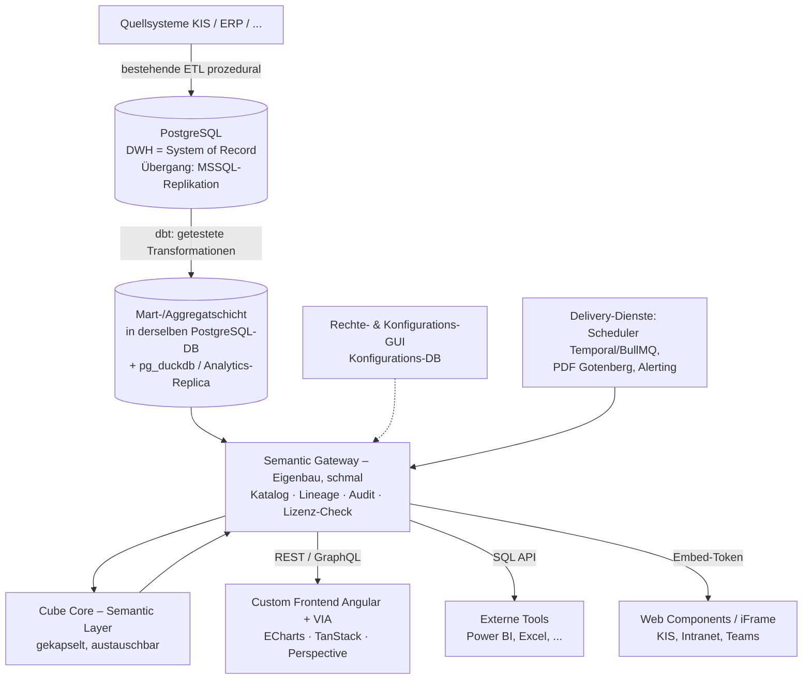

# Architekturansatz B – PostgreSQL-First Composable Platform

> [!abstract] Kernidee
> **Ein einziger Datenspeicher statt zwei:** PostgreSQL ist DWH **und** analytische Serving-Schicht – es gibt keine zweite Engine (kein ClickHouse) und damit **keine Sync-Strecke**. Analytische Performance kommt aus einer **kuratierten, dbt-gepflegten Mart-/Aggregatschicht** plus spaltenorientierter Beschleunigung *innerhalb* von Postgres (pg_duckdb / Analytics-Replica). Der Semantic Layer (Cube Core) wird hinter ein **eigenes, schmales „Semantic Gateway"** gekapselt, das zugleich Katalog, Lineage, Audit und Lizenz-Checks trägt. Präsentationsschicht, Rechtemodell und Embedding übernehmen die bereits gemeinsam erarbeiteten Entscheidungen aus [[Architekturansatz A – ClickHouse + Cube Core + Custom Frontend|Ansatz A]] unverändert.

> [!info] Verhältnis zu Ansatz A
> Dies ist ein **eigenständiger Gegenentwurf**, kein Derivat. Er entstand aus einem Premortem von Ansatz A (Abschnitt 0) und unterscheidet sich bewusst dort, wo A die größten Ausfallrisiken trägt: **Dual-Store-Sync, Betriebskomplexität, Eigenbau-Volumen, Cube-Kapselung**. Wo A-Entscheidungen unabhängig von der Engine richtig sind (Angular/VIA, ECharts, TanStack/Perspective, Rechtemodell, Embedding, Custom-Erweiterungen), übernimmt B sie ausdrücklich – Differenz um der Differenz willen wäre schlechte Architektur.

---

## 0 · Premortem zu Ansatz A – warum B existiert

*Gedankenexperiment: Es ist 2029, Ansatz A ist gescheitert. Was ist am wahrscheinlichsten passiert?*

| # | Ausfallszenario | Mechanismus |
| --- | --- | --- |
| P1 | **Der Eigenbau-Tsunami** | Das Team baut faktisch eine komplette BI-Suite nach (Designer, Report-Engine, Alerting, Kollaboration, Admin-GUI, NLQ). Time-to-Market rutscht auf 3+ Jahre; das eigentliche Moat – das **Fachmodell** ([[Wettbewerbsvorteil & Fachmodell]]) – wird ressourcenseitig ausgehungert, weil alle Kapazität in Plattform-Plumbing fließt. |
| P2 | **Sync-Drift zerstört Datenvertrauen** | Die CDC-/Batch-Strecke DWH → ClickHouse produziert schleichende Inkonsistenzen (Latenz, Mutationen, Reihenfolge). Ein Chefarzt sieht im Dashboard eine andere Fallzahl als im Monatsbericht. [[UI, UX & Design#Datenvertrauen|Datenvertrauen]] ist im Pflichtenheft ein Kernprinzip – **eine einzige falsche Zahl beim falschen Nutzer kostet die Adoption eines ganzen Hauses.** |
| P3 | **Zwei parallele Großmigrationen** | SSAS→Cube **und** MSSQL→PostgreSQL laufen gleichzeitig; beide beanspruchen dieselben Fachlogik-Kenner. Eine der beiden bleibt liegen. |
| P4 | **ClickHouse-Modellierungs-Mismatch** | Die Übersetzung der relationalen SSAS-/Stored-Procedure-Welt in denormalisierte ClickHouse-Strukturen ist ein drittes, verstecktes Migrationsprojekt. Das Team kann T-SQL – nicht ClickHouse-Denormalisierung. |
| P5 | **Cube-Feature-Gating** | Cube verschiebt weitere Kernfunktionen in die kommerzielle Cloud; das Produkt hängt an einem VC-finanzierten Anbieter ohne Kapselungsschicht. |
| P6 | **Klinik-IT lehnt den Stack ab** | MSSQL/PG + ClickHouse + Cube + Cube Store + eigene Services + Frontend: zu viele bewegliche Teile für konservative Krankenhaus-IT (Citrix, Proxies, Wartungsfenster). Das „kleine Einstiegsprofil" existiert auf Folien, nicht im Rechenzentrum. |

**Designziele für B**, direkt abgeleitet: (Z1) Sync-Strecke eliminieren statt absichern → P2. (Z2) Migrationspfade *serialisieren* statt parallelisieren → P3/P4. (Z3) Beweglich­e Teile minimieren → P6. (Z4) Cube kapseln → P5. (Z5) Eigenbau durch konkrete Wiederverwendung verkleinern → P1.

---

## 1 · Zielbild

### Schichten

### Verantwortlichkeiten je Schicht

| Schicht | Komponente | Verantwortung |
| --- | --- | --- |
| Datenhaltung | **PostgreSQL (einzig)** | System of Record, ETL (PL/pgSQL), **und** analytische Marts – eine physische Wahrheit |
| Transformation | **dbt Core** | Versionierte, **getestete** Transformationen Rohdaten → Marts/Aggregate; Fachmodule als dbt-Pakete |
| Beschleunigung | pg_duckdb / Analytics-Replica | Spaltenorientierte Scans in Postgres; Leselast von der ETL-Instanz getrennt |
| Semantik | Cube Core **hinter Semantic Gateway** | Kennzahlen-Definition & Query-Kompilierung (Cube); Katalog, Lineage, Audit, Lizenz, Versionsauskunft (Gateway) |
| Präsentation | wie Ansatz A | Angular + VIA, ECharts, TanStack Table, Perspective, Web-Component-Embedding |
| Delivery | dünne Dienste auf OSS-Bausteinen | Scheduling (Temporal/BullMQ), HTML→PDF (Gotenberg), Alert-Evaluation über Gateway-Queries |
| Administration | wie Ansatz A | Rechte-GUI auf Konfigurationsspeicher, deny-by-default, Audit-Ansicht + Audit-Log |

---

## 2 · Komponenten im Detail

### 2.1 PostgreSQL als einziger Datenspeicher

- **Kein Dual-Store:** ETL, System of Record und analytisches Serving leben in **einer** Datenbanktechnologie. Der geplante MSSQL→PostgreSQL-Umstieg wird vom Parallelrisiko (A/P3) zum **Enabler**: Es gibt genau *eine* Datenmigration, und sie schafft zugleich die Zielplattform. Übergangsweise repliziert Postgres aus MSSQL (logische Replikation/FDW/Batch), bis die ETL portiert ist.
- **Performance-Strategie – „aggregieren statt replizieren":** BI-Last besteht überwiegend aus Aggregatabfragen. Statt Detaildaten in eine zweite Engine zu kopieren, werden **kuratierte Marts und Aggregattabellen** gepflegt (dbt, inkrementell aktualisiert). Für spaltenorientierte Scans auf großen Marts: **pg_duckdb** (DuckDB-Engine in Postgres) bzw. DuckDB auf publizierten Parquet-Snapshots; ergänzend eine **dedizierte Analytics-Replica**, damit Ad-hoc-Last nie die ETL stört.
- **Zielwerte:** ≤ 2 s Standard-Dashboards ([[Performance & Antwortzeiten]]) sind über Marts + Cube-Caching realistisch; Detail-Drill bis Fallebene läuft gegen indizierte relationale Tabellen – dort ist Postgres zu Hause.
- **Skalierungs-Fluchttür:** Sollte ein sehr großer Verbund (F8!) die Grenzen sprengen, kann **pro Groß-Mandant** eine ClickHouse-Serving-Instanz hinter dem Semantic Gateway nachgerüstet werden, ohne Frontend oder Semantik anzufassen – Skalierung als *Option*, nicht als Grundlast für alle.

### 2.2 dbt als Fachmodell-Materialisierung

- Die Transformationen Rohdaten → Fachmarts werden in **dbt Core** (Apache 2.0) gepflegt: versioniert, dokumentiert, mit **eingebauten Daten-Tests** – das bedient die QA-/Versionierungs-Anforderung aus [[Entwicklung & Qualitätssicherung]] direkt mit Bordmitteln.
- **Fachmodule = dbt-Pakete + Cube-Modelle + Widget-Bundles.** Die Lizenz-→-Provisionierungs-Kette aus Ansatz A (F3) gilt identisch; die Provisionierung führt zusätzlich die dbt-Modelle des Moduls aus.
- dbt-Lineage + Dokumentation speisen den **Datenkatalog/Herkunftsnachweis** ([[API, Semantic Layer & Schnittstellen#Datenkatalog & Herkunft (Datenvertrauen)]]) – in A ein reiner Eigenbau, hier zur Hälfte geschenkt.
- **Migrationsvorteil:** SSAS-/Stored-Procedure-Logik wird nach **SQL** übersetzt (dbt-Modelle), nicht in eine fremde Denormalisierungs-Denkwelt – das trifft die vorhandenen T-SQL-Kompetenzen des Teams (adressiert A/P4).

### 2.3 Semantic Gateway + Cube Core (gekapselt)

- **Cube Core bleibt** die Semantik-/Query-Engine – ehrlich betrachtet die beste verfügbare OSS-Option; ein Eigenbau-Query-Compiler wäre das klassische Grab.
- **Neu: ein schmales, eigenes Semantic Gateway davor.** Alle Konsumenten (Frontend, Embedding, externe Tools, Delivery-Dienste) sprechen ausschließlich mit dem Gateway. Es ist bewusst dünn (kein Query-Rewriting) und bündelt genau das, was in A verstreuter Eigenbau wäre:
    - **Katalog & Versionsauskunft** (CALC-14, Datenvertrauen): Definition, Berechnung, Herkunft, Stand, Version je Kennzahl – gespeist aus Cube-Meta + dbt-Lineage.
    - **Audit-Logging** aller Datenabrufe ([[Sicherheit & Zugriffsschutz#Protokollierung (Audit)]]) an einer Stelle.
    - **Lizenz-Enforcement** (Modul lizenziert?) vor der Rechteprüfung.
    - **Kapselung** (adressiert A/P5): Cube ist hinter einer eigenen API austausch-/forkbar, Konsumenten merken nichts.
- Rechte-Enforcement bleibt in Cube (Security Context, deny-by-default), Konfigurationsspeicher + Consultant-GUI **identisch zu Ansatz A** inkl. Audit-Ansicht/-Log und kundenseitigen Custom-Erweiterungen (eigener Namespace; Custom-Tabellen liegen im Mandanten-Schema).

### 2.4 Präsentation & Embedding – Übernahme aus Ansatz A

Unverändert übernommen, da engine-unabhängig richtig: **Angular + VIA**, **ECharts** mit VIA-Theme, **TanStack Table + Perspective** für Tabellen/Pivot, **Web Components + iFrame** mit kurzlebigen Embed-Tokens, Widget-first mit Interaktionstiefen, Zwei-Ebenen-Berechtigung (Daten vs. Dashboard/App), Widget-Erstellung als privilegiertes Recht.

### 2.5 Delivery-Dienste: Wiederverwenden statt Erfinden (adressiert A/P1)

Statt Event-/Report-Engine vollständig neu zu entwerfen, werden bewährte OSS-Bausteine zu **dünnen Diensten** komponiert:

| Baustein | Aufgabe | Lizenz |
| --- | --- | --- |
| **Temporal** oder **BullMQ** | Zeitpläne, Abos, Retry-Logik für Berichte & Alerts | MIT |
| **Gotenberg** (Chromium-Service) | HTML→PDF-Rendering der Berichtsmappen (SSR-ECharts-HTML rein, CI-PDF raus) | MIT |
| Eigenanteil | Schwellwert-Evaluation als periodische Gateway-Queries; Empfängerregeln; Zustellkanäle (Mail, Teams, Push) | – |

Damit schrumpft „Push statt Pull" ([[Leitprinzipien#Push statt Pull]]) von *Engine bauen* auf *Regeln + Zustellung bauen*.

### 2.6 Multi-Tenancy

**Schema pro Mandant in PostgreSQL** (SaaS) bzw. eigene Instanz (on-prem) – strukturgleich zur A-Entscheidung „DB pro Mandant", gleiche Begründung (Isolation, C5-Nachweis, Backup/Sunset je Kunde, Heimat der Custom-Tabellen). Sehr große Mandanten erhalten eine eigene PG-Instanz (bzw. die ClickHouse-Fluchttür aus 2.1).

---

## 3 · Premortem zu Ansatz B selbst

*Gleiche Übung, andere Richtung: Es ist 2029, Ansatz B ist gescheitert. Warum?*

| # | Ausfallszenario | Gegenmaßnahme |
| --- | --- | --- |
| Q1 | **Postgres skaliert nicht für den 30-Häuser-Verbund:** feingranulare Ad-hoc-Analysen über Milliarden Fällen brechen die 2-s-Marke; Marts decken die explorativen Pfade nicht ab. | Früher **Benchmark mit realen Volumina** (F8 zwingend!); Fluchttür ClickHouse-pro-Groß-Mandant ist eingeplant, aber nachträgliche Nachrüstung kostet. **Dies ist das Kernrisiko von B.** |
| Q2 | **pg_duckdb/Analytics-Extensions unreif:** Die Beschleunigungsschicht ist jünger und weniger kampferprobt als ClickHouse. | Architektur funktioniert auch ohne (Marts + Replica); Extension ist Beschleuniger, nicht Fundament. Im PoC ohne Extension messen. |
| Q3 | **Mart-Pflege wird zur Dauerbaustelle:** Jede neue Analyseachse braucht ggf. ein neues Aggregat; das Fachmodell-Team wird zum Mart-Feuerwehrteam. | dbt macht Marts günstig (Templates, Tests, Generierung aus Modul-Definitionen); Cube-Pre-Aggregationen fangen Ad-hoc-Lücken. Trotzdem: realer Mehraufwand ggü. „ClickHouse rechnet roh". |
| Q4 | **„Nahezu Echtzeit" auf Detaildaten leidet:** inkrementelle Mart-Aktualisierung hat Latenz. | Detail-Drill läuft gegen die relationalen Live-Tabellen (keine Latenz); nur hochaggregierte Sichten haben Mart-Aktualität – Freshness-Indikatoren machen es transparent. |
| Q5 | **Das Semantic Gateway wuchert:** aus „schmal" wird ein zweiter Backend-Monolith. | Harte Regel: Gateway macht **kein** Query-Rewriting und **keine** Fachlogik – nur Katalog/Audit/Lizenz/Passthrough. Architektur-Review-Kriterium. |
| Q6 | **MSSQL-Übergangsreplikation nach Postgres** ist ebenfalls eine Sync-Strecke (Widerspruch zu Z1). | Stimmt – aber **temporär** und in Richtung des ohnehin beschlossenen Ziels, nicht dauerhaft-strukturell wie in A. Abschaltdatum = Ende der ETL-Portierung. |

---

## 4 · Bewertung

### 4.1 Stärken

| # | Stärke | Wirkung |
| --- | --- | --- |
| S1 | **Eine physische Wahrheit** | Kein Sync, kein Drift, keine widersprüchlichen Zahlen zwischen Kanälen – maximale Absicherung des Pflichtenheft-Kernprinzips Datenvertrauen |
| S2 | **Minimaler Betriebs-Stack** | PG + Cube/Gateway + Frontend (+ 2 dünne Dienste). Das „kleine, wirtschaftliche Einstiegsprofil" ([[Betrieb, Performance & Compliance]]) ist real: eine DB, die Klinik-IT ohnehin kennt |
| S3 | **Eine Migration statt drei** | MSSQL→PG ist der einzige Datenumzug und zugleich Zielbild; SSAS-Logik wandert nach SQL/dbt (Team-Skill-Fit), keine ClickHouse-Denormalisierung |
| S4 | **dbt-Tests & -Lineage geschenkt** | QA-Anforderung ([[Entwicklung & Qualitätssicherung]]) und halber Datenkatalog aus Bordmitteln statt Eigenbau |
| S5 | **Cube gekapselt** | Semantic Gateway macht die Plattform unabhängig von Cube-Roadmap-Entscheidungen; Katalog/Audit/Lizenz an einem Ort statt verstreut |
| S6 | **Delivery-Reuse** | Temporal/BullMQ + Gotenberg verkleinern den größten Kostentreiber (Report-/Alert-Engine) auf Regeln + Zustellung |
| S7 | **Vollständig Open Source** | Wie A: keine Runtime-Lizenzkosten, kein OEM-Risiko – stützt Plattform-Geschäftsmodell und [[Lizenzmodell-Potenzial]] |
| S8 | **Skalierung als Option** | ClickHouse kann später gezielt pro Groß-Mandant hinter dem Gateway ergänzt werden – A's Stärke bleibt als Fluchttür erreichbar, ohne A's Grundkomplexität für alle |

### 4.2 Schwächen & Risiken

| # | Risiko | Beschreibung | Schwere |
| --- | --- | --- | --- |
| B-R1 | **Analytische Rohleistung** | Bei sehr großen Volumina + explorativen Ad-hoc-Pfaden ohne passendes Aggregat ist Postgres ClickHouse klar unterlegen (Q1). Ohne F8-Zahlen nicht abschließend bewertbar. | 🔴 hoch (bis Benchmark) |
| B-R2 | **Mart-Engineering als Daueraufwand** | Performance ist Design-Arbeit (Aggregate pflegen), nicht Engine-Eigenschaft (Q3). | 🟠 mittel–hoch |
| B-R3 | **Reifegrad pg_duckdb & Co.** | Beschleunigungs-Extensions jünger als ClickHouse (Q2); Fallback vorhanden, kostet aber Zielwerte. | 🟡 mittel |
| B-R4 | **Eigenbau-Umfang bleibt erheblich** | Frontend, Designer, Kollaboration, NLQ, Mobile-App: identisch zu A. Reuse (2.5) verkleinert nur den Delivery-Block. | 🔴 hoch (wie A) |
| B-R5 | **Semantic Gateway = zusätzliche Eigenkomponente** | Neue Schicht, die A nicht hat; Scope-Disziplin nötig (Q5). | 🟡 mittel |
| B-R6 | **Cube-Grenzen unverändert** | XMLA/OData-Lücke, Visual Modeler in Cloud – identisch zu A (dort R1/R6), durch Gateway nur *austauschbarer*, nicht gelöst. | 🟡 mittel |
| B-R7 | **Übergangsreplikation MSSQL→PG** | Temporäre Sync-Strecke bis ETL-Portierung (Q6). | 🟡 mittel (befristet) |

---

## 5 · Abgleich mit dem Pflichtenheft

Legende (identisch zu Ansatz A): ✅ gut abgedeckt · 🟡 abgedeckt mit Eigenbau/Konzeptarbeit · 🔴 Lücke im vorgeschlagenen Stack

| Pflichtenheft-Bereich | Bewertung | Anmerkung |
| --- | --- | --- |
| Semantik als Single Point of Truth, versioniert ([[Voraussetzung – Semantische Schicht]]) | ✅ | Cube-Modelle + dbt-Modelle versioniert; Katalog/Versionsauskunft (CALC-14) **im Gateway verortet** statt verstreut – strukturell besser bedient als in A |
| Frontend ohne Fachlogik, nur API-Zugriff | ✅ | Architektonisch erzwungen (Gateway-only) |
| Widget-first, kanalagnostisch, Interaktionstiefen | ✅/🟡 | Identisch zu A (Übernahme) |
| Embedded Analytics / Headless (EXP-15) | ✅/🟡 | Identisch zu A: Web Components + iFrame, Embed-Token |
| Externe Tools auf derselben Semantik (Power BI, Excel) | 🟡 | Identisch zu A: SQL API / .xlsx-Export; XMLA/OData Ausbaustufe (Cube-Grenze, B-R6) |
| Rollen-/Rechtemodell, RLS kanalübergreifend, Backend-Enforcement | ✅/🟡 | Identisch zu A (Cube Security Context, deny-by-default, Zwei-Ebenen-Modell); zusätzlich zentrales Zugriffs-Audit im Gateway |
| Konfiguration statt Code (kundenseitig) | ✅ | Identisch zu A inkl. Custom-Tabellen/-Spalten im Mandanten-Schema |
| Mandantenfähigkeit + CI/White-Labeling | ✅/🟡 | Schema/Instanz pro Mandant; physische Trennung on-prem, logisch-starke Trennung SaaS; C5-Nachweis etwas schwächer als „DB pro Mandant" in A, per Instanz-pro-Großkunde ausgleichbar |
| Push statt Pull / Alerting / Abos | 🟡 | **Kleinerer Eigenbau als A**: Scheduling/Retry aus Temporal/BullMQ, Eigenanteil = Schwellwertregeln + Zustellkanäle |
| Berichtswesen: PDF/Excel, Berichtsmappen, zeitgesteuert (EXP-01…14) | 🟡 | **Kleinerer Eigenbau als A**: Gotenberg für HTML→PDF; Berichtsmappen-Logik + Rechteprüfung beim Rendern bleiben Eigenanteil |
| Visualisierungen (VIS-01…08) | ✅ | Identisch zu A (ECharts + TanStack + Perspective, Monochrom via Decals) |
| Filter, Drill, Deep Links (FIL-01…17) | 🟡 | Identisch zu A; Detail-Drill auf Fallebene läuft gegen relationale Live-Tabellen – für FIL-04 (Fallebene) sogar natürlicher als ClickHouse |
| Berechnete Felder im UI (CALC-01…16) | 🟡 | Identisch zu A (CALC-13-Grenze) |
| KI: NLQ, Insights, Why, Prognose (KI-01…19) | 🟡 | Identisch zu A; Meta-API + dbt-Lineage geben dem NLQ-Kontext sogar mehr Herkunftsinformation |
| Performance-Ziele | 🟡/✅ | ≤ 2 s Standard über Marts + Caching realistisch; **großvolumige Ad-hoc-Exploration ist die offene Flanke** (B-R1) – Benchmark nötig; „nahezu Echtzeit" auf Details ✅ (Live-Tabellen), auf Hochaggregaten 🟡 (Mart-Latenz, Freshness-Indikator) |
| Deployment on-prem / SaaS / BYOC, kleines Einstiegsprofil | ✅ | **Stärkster Bereich von B**: eine vertraute DB, wenige Container; Einstiegsprofil kleiner als A |
| C5 / DSGVO Art. 9 / EU-Hosting | ✅/🟡 | OSS, selbst gehostet; Mandantentrennung per Schema/Instanz; Audit zentral im Gateway |
| Sicherheit (SSO OIDC/SAML, JWT, CSP, Audit) | 🟡 | Identisch zu A; Zugriffs-Audit strukturell einfacher (ein Gateway) |
| Module einzeln lizenzierbar/aktualisierbar, Lizenzschlüssel | ✅/🟡 | Modul = dbt-Paket + Cube-Modelle + Widgets + Lizenz-Flag; Lizenz-Enforcement im Gateway verortet |
| Mehrsprachigkeit, Barrierefreiheit | 🟡 | Identisch zu A |
| Native Mobile-App (Alerting) | 🔴→🟡 | Identisch zu A (separates Projekt, API-first) |
| Strangler-Fig-Migration | ✅/🟡 | **Besser als A**: Altsystem und Neusystem teilen sich denselben Datenbestand (erst MSSQL-Replikat, dann PG) – Vergleichsrechnungen SSAS vs. Cube gegen identische Daten, kein Sync-Rauschen in der Validierung |

---

## 6 · Was sich mit Ansatz B (so) nicht oder schwerer umsetzen lässt

> [!failure] Ehrliche Lücken
> 1. **Garantierte Sub-2-Sekunden-Antworten auf beliebige Ad-hoc-Pfade über sehr große Rohdatenmengen** – das ist ClickHouse-Terrain. B beantwortet definierte Analysepfade schnell (Marts) und Detailzugriffe schnell (relationale Indizes), aber die freie Exploration „quer über alles, sofort" ohne passendes Aggregat kann die Zielwerte reißen (B-R1). Ob das praxisrelevant ist, entscheiden F8-Volumina und das reale Nutzungsprofil des Medizincontrollers.
> 2. **XMLA/OData** – identische Lücke wie A (Cube-Grenze), durch das Gateway später als eigenes Produkt-Feature nachrüstbar, aber nicht vorhanden.
> 3. **Fertige Delivery-/Kollaborations-Features** – wie A bleibt vieles Eigenbau; B verkleinert den Block (2.5), eliminiert ihn nicht.

---

## 7 · Offene Fragen (Ansatz B)

> [!question] B-F1 – Benchmark-Entscheid (≙ F8)
> Reale Volumina eines großen Referenzkunden (Fälle/Jahr, Dimensionalität, Nutzerparallelität) gegen beide Serving-Varianten benchmarken: PG+Marts(+pg_duckdb) vs. ClickHouse. **Dies ist die eigentliche A-vs-B-Entscheidungsfrage.**

> [!question] B-F2 – Mart-Governance
> Wer definiert/pflegt Aggregate je Fachmodul – Produktteam ausschließlich, oder brauchen Consultants ein kontrolliertes „Aggregat anfordern/generieren"?

> [!question] B-F3 – Gateway-Schnitt
> Minimal-Scope des Semantic Gateway vertraglich festschreiben (Katalog, Audit, Lizenz, Passthrough – sonst nichts), um Q5 zu bannen.

> [!question] B-F4 – Übergangsreplikation
> Mechanik MSSQL→PG für die Übergangszeit (FDW vs. logische Replikation vs. Batch) und hartes Abschaltkriterium.

---

## 8 · Vor- und Nachteile: Ansatz B gegenüber Ansatz A

> [!abstract] Einordnung vorab
> A und B teilen ~80 % der Architektur: Semantic Layer (Cube), Rechtemodell, Frontend-Stack, Embedding, Custom-Erweiterungen, Modullogik. Die Entscheidung reduziert sich im Kern auf **eine Frage: dedizierte Analytik-Engine mit Sync (A) oder ein konsolidierter Speicher mit Aggregat-Design (B)?** – plus B's Zusatzideen (Gateway, dbt, Delivery-Reuse), die teilweise auch in A adaptierbar wären.

### Vorteile von B gegenüber A

| # | Vorteil | Begründung |
| --- | --- | --- |
| V1 | **Kein Sync-Drift-Risiko** | Die gefährlichste stille Fehlerquelle von A (P2, Datenvertrauen) existiert strukturell nicht: eine physische Wahrheit. |
| V2 | **Halber Betriebs-Stack** | Eine DB-Technologie weniger, keine CDC-Pipeline, kein Cube Store-Sonderbetrieb für Pre-Aggs auf Fremd-Engine → kleineres Einstiegsprofil, leichtere C5-/Klinik-IT-Abnahme. |
| V3 | **Ein Migrationspfad statt drei** | Nur MSSQL→PG (ohnehin beschlossen); SSAS-Logik → SQL/dbt statt zusätzlich ClickHouse-Denormalisierung; keine dauerhafte Sync-Strecke zu bauen. |
| V4 | **Team-Skill-Fit** | T-SQL-Kompetenz überträgt sich auf PL/pgSQL + dbt-SQL nahezu direkt; ClickHouse-Modellierung wäre eine neue Disziplin. |
| V5 | **Datenkatalog & QA günstiger** | dbt-Tests, -Docs und -Lineage liefern Substanz für Datenvertrauen/CALC-14, die A komplett selbst bauen muss. |
| V6 | **Cube-Kapselung** | Das Gateway macht den Semantic-Layer-Anbieter austauschbar und zentralisiert Audit/Lizenz/Katalog – in A ist Cube direkter Single Point of Lock-in. |
| V7 | **Kleinerer Delivery-Eigenbau** | Konkrete Reuse-Bausteine (Temporal/BullMQ, Gotenberg) statt Green-Field-Engine. |
| V8 | **Fallebenen-Drill natürlicher** | FIL-04-Detailzugriffe (Fall, Patient) laufen auf indizierten relationalen Tabellen – Postgres-Kernterrain, in ClickHouse eher unbequem. |

### Nachteile von B gegenüber A

| # | Nachteil | Begründung |
| --- | --- | --- |
| N1 | **Analytische Rohleistung** | ClickHouse ist bei großen Scans/hoher Kardinalität um Größenordnungen schneller. B erkauft Einfachheit mit Design-Arbeit (Marts) und trägt das Restrisiko, bei Groß-Verbünden die Zielwerte zu reißen (B-R1). |
| N2 | **Performance ist Arbeit, nicht Eigenschaft** | Jede neue Analyseachse kann ein Aggregat erfordern; A beantwortet auch unvorhergesehene Ad-hoc-Pfade roh und schnell. Für die explorative Kern-Persona Medizincontroller ist das ein echter Punkt für A. |
| N3 | **Jüngere Beschleunigungs-Schicht** | pg_duckdb & Co. sind weniger kampferprobt als ClickHouse; Fallback existiert, kostet aber Luft bei den Zielwerten. |
| N4 | **Zusätzliche Eigenkomponente** | Das Semantic Gateway ist Mehraufwand und ein Wucher-Risiko (Q5) – A kommt ohne diese Schicht aus. |
| N5 | **„Nahezu Echtzeit" auf Hochaggregaten** | Mart-Aktualisierung hat Latenz; A's ClickHouse rechnet aggregierte Ad-hoc-Sichten live auf frischen Detaildaten. |
| N6 | **Mandantentrennung SaaS eine Stufe weicher** | Schema-pro-Mandant < DB-pro-Mandant im C5-Nachweis; ausgleichbar (Instanz pro Großkunde), aber A's Default ist strenger. |
| N7 | **Skalierungs-Story weniger geradlinig** | A skaliert homogen (ClickHouse-Cluster); B's Fluchttür (ClickHouse pro Groß-Mandant) reintroduziert im Extremfall genau die Dualität, die B vermeiden wollte. |

### Empfehlung zur Entscheidung

1. **F8 zuerst beziffern** (Zielgrößen: Fälle, Dimensionalität, parallele Nutzer, Mandanten) – ohne diese Zahlen ist A-vs-B ein Glaubenskrieg.
2. **Ein gemeinsamer PoC, zwei Serving-Backends:** identisches Cube-Modell + identische Widgets einmal gegen ClickHouse (A), einmal gegen PG+Marts (B) mit realen Referenzdaten; gemessen werden die Pflichtenheft-Zielwerte inkl. Ad-hoc-Pfaden des Medizincontrollings. Der Rest der Architektur (≈ 80 %) ist deckungsgleich und in beiden Fällen sofort weiterverwendbar.
3. **B-Ideen unabhängig vom Ausgang prüfen:** Semantic Gateway, dbt-Schicht und Delivery-Reuse sind auch in Ansatz A adaptierbar – sie hängen nicht an der Speicherfrage.

---

## Änderungshistorie

| Version | Datum | Änderung |
| --- | --- | --- |
| 0.1 | 2026-07-27 | Erstfassung: eigenständiger Gegenentwurf mit Premortem zu A und zu B selbst, Pflichtenheft-Abgleich (Struktur identisch zu Ansatz A), Vergleich B vs. A |
